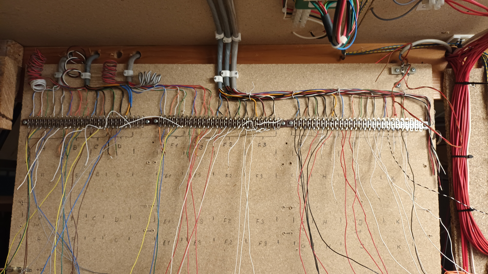

# Hjulby_Signal_led

## Kilde

* Hjulby Pult Klemrække Signal
  * [Hjulby_Signal_Klemrække_A.pdf](./Kilde)
  * [Hjulby_Signal_Klemrække_B.pdf](./Kilde)
  * [Hjulby_Signal_Klemrække_C.pdf](./Kilde)
* Hjulby_Klemrække Led antal total: 3 x 28
  * Hjulby_Klemrække_X:
    * Signal Led: 62
* Images
  * 

## Signaler Hjulby

|Klemrække|Pin|Signal Led|/|MCU Terminal Addr.|Entites Name|
|:---:|:---:|:---|:---:|:---:|:---|
|A|01|A-Øverste-Gul|/|43-15||
|A|02|A-Øverste-Grøn|/|43-14||
|A|03|A-Rød|/|43-13||
|A|04|A-Nederste-Grøn|/|43-12||
|A|05|A+|/|+||
|A|06|A-75Km|/|43-11||
|A|07|A-40Km|/|43-10||
|A|08|A-60Km|/|43-09||
|A|09|A+|/|+||
|A|10|B-Gul|/|43-08||
|A|11|B-Hvid|/|43-07||
|A|12|B-Hvid|/|43-06||
|A|13|B-Rød|/|43-05||
|A|14|B-Grøn|/|43-04||
|A|15|B+|/|+||
|A|16|C-Øverste-Grøn|/|43-03||
|A|17|C-Rød|/|43-02||
|A|18|C-Nederste-Grøn|/|43-01||
|A|19|C+|/|+||
|A|20|D-Gul|/|43-00||
|A|21|D-Hvid|/|42-15||
|A|22|D-Hvid|/|42-14||
|A|23|D-Rød|/|42-13||
|A|24|D-Grøn|/|42-12||
|A|25|D+|/|+||
|A|26||/|||
|A|27||/|||
|A|28||/|||
|B|01|E1-Hvid|/|42-11||
|B|02|E1-Hvid|/|42-10||
|B|03|E1-Hvid|/|42-09||
|B|04|E1-Rød|/|42-08||
|B|05|E1-Grøn|/|42-07||
|B|06|E1+|/|+||
|B|07||/|||
|B|08|E3-Hvid|/|42-06||
|B|09|E3-Hvid|/|42-05||
|B|10|E3-Hvid|/|42-04||
|B|11|E3-Rød|/|42-03||
|B|12|E3-Grøn|/|42-02||
|B|13|E3+|/|+||
|B|14|F2-Grøn|/|42-01||
|B|15|F2-Rød|/|42-00||
|B|16|F2-Hvid|/|41-15||
|B|17|F2-Hvid|/|41-14||
|B|18|F2-Hvid|/|41-13||
|B|19|F2-Hvid|/|41-12||
|B|20|F2+|/|+||
|B|21|F3-Grøn|/|41-11||
|B|22|F3-Rød|/|41-10||
|B|23|F3-Hvid|/|41-09||
|B|24|F3-Hvid|/|41-08||
|B|25|F3-Hvid|/|41-07||
|B|26|F3-Hvid|/|41-06||
|B|27|F3+|/|+||
|B|28||/|||
|C|01|G-Øverste-Grøn|/|41-05||
|C|02|G-Rød|/|41-04||
|C|03|G-Nederste-Grøn|/|41-03||
|C|04|G+|/|+||
|C|05|H-Gul|/|41-02||
|C|06|H-Hvid|/|41-01||
|C|07|H-Hvid|/|41-00||
|C|08|H-Rød|/|40-15||
|C|09|H-Grøn|/|40-14||
|C|10|H+|/|+||
|C|11|J-Øverste-Gul|/|40-13||
|C|12|J-Øverste-Grøn|/|40-12||
|C|13|J-Rød|/|40-11||
|C|14|J-Nederste-Grøn|/|40-10||
|C|15|J+|/|+||
|C|16|J-75Km|/|40-09||
|C|17|J-40Km|/|40-08||
|C|18|J-60Km|/|40-07||
|C|19|J+|/|+||
|C|20|K-Gul|/|40-06||
|C|21|K-Hvid|/|40-05||
|C|22|K-Hvid|/|40-04||
|C|23|K-Rød|/|40-03||
|C|24|K-Grøn|/|40-02||
|C|25|K+|/|+||
|C|26||/|||
|C|27||/|||
|C|28||/|||
