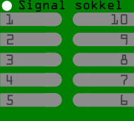

# OMJK Signal Sokkel

|SignalSokkel|PU|
|:---:|:---:|
|||

||Pin Nr.||
|:---|:---:|:---|
|Orange/Gul|1|Orange/Hvid|
|Orange/Grøn|2|Orange/Grøn|
|Orange/Blå|3|Orange/Blå|
|Gul/Sort|4|Gul/Sort|
|Gul/Grøn|5|Gul/Grøn|
|Gul/Blå|6|Gul/Blå|
|Gul/Hvid|7|Gul/Hvid|
|Grøn/Sort|8|Grøn/Sort|
|Grøn/Blå|9|Grøn/Blå|
|Grøn/Grå|10|Grøn/Grå|

## Cat5 kabel til PU-signal

|Cat5 4x2|PU Lampe|PU farve|Sokkel Nr.|Sokkel  Farve|Eller|
|:---:|:---:|:---:|:---:|:---|:---|
|Brun|1.| 0V/Stel/GND|1.| Gul/Grøn|Orange/Hvid|
|Brun/Hvid|2.|Gul|2.|Gul/Sort|Orange/Grøn|
|||||||
|Blå|3.|Gul|3.|Orange/Blå|Orange/Blå|
|Blå/Hvid|4.|Gul|4.|Orange/Grøn|Gul/Sort|
|||||||
|Grøn|5.|Gul|5.|Hvid/Orange|Gul/Grøn|
|Grøn/Hvid|6.|Gul|6.|Gul/Blå|Gul/Blå|
|||||||
|Orange|7.|Rød|7.|Gul/Hvid|Gul/Hvid|
|||||||
||||8.|Grøn/Sort|Grøn/Sort|
||||9.|Grøn/Blå|Grøn/Blå|
||||10.|Grøn/Blå|Grøn/Grå|
