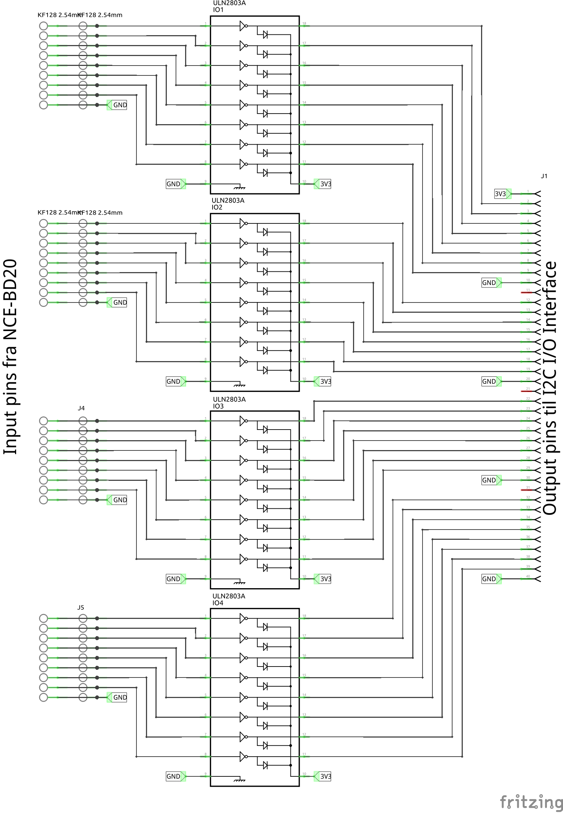
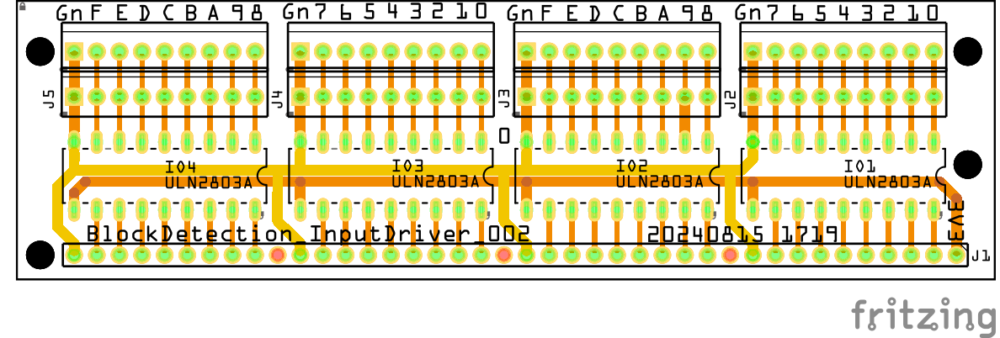

# BlockDetection

## NEC_BD20

### Princip diagram

|Schematic|
|:---:|
||

|PCB|
|:---:|
||

* Fritzing files:
  * [BD20_InputInterface_002.fzz](./NEC_BD20/BD20_InputInterface/BD20_InputInterface_002.fzz)
