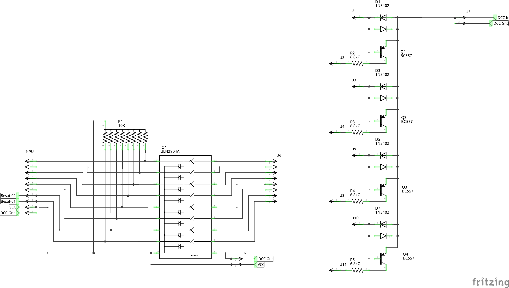
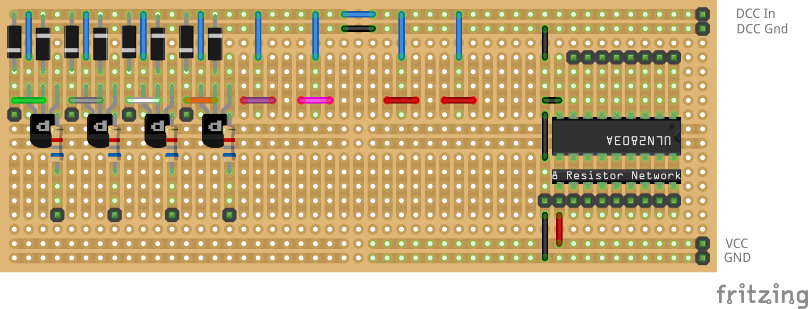
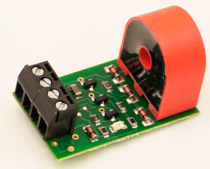
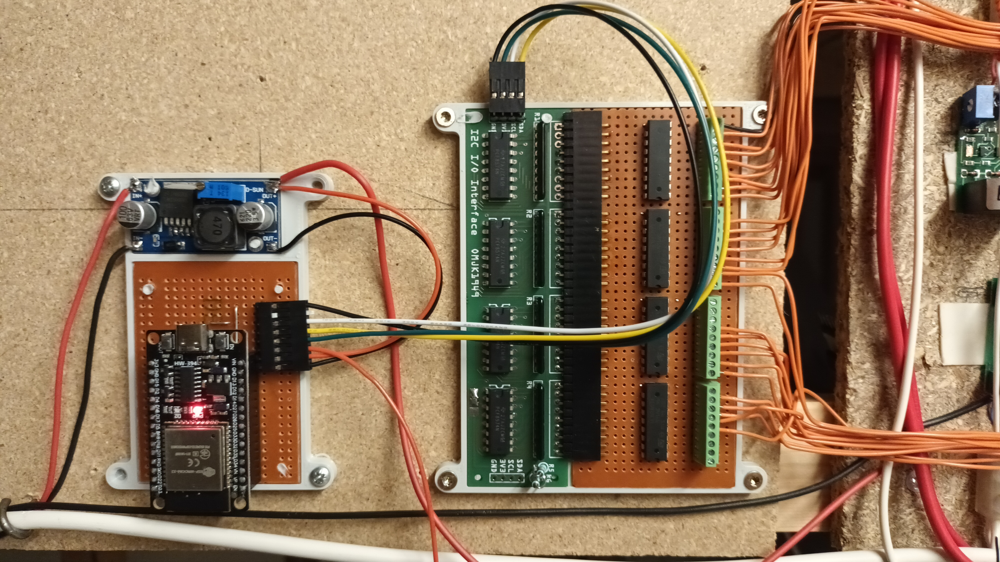
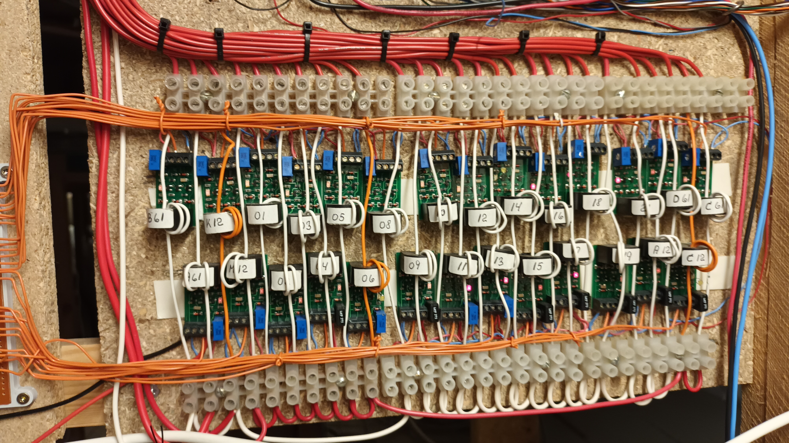
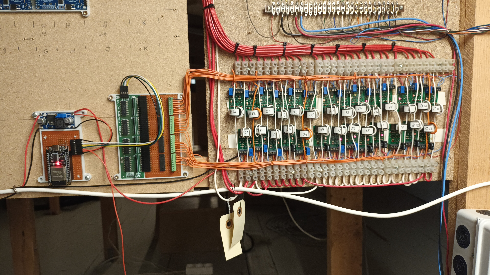

# BlockDetection

## ULN2804A Prototype Hjulby

Inspireret af [Moppe.dk](https://moppe.dk/besat.html) Sporbesatmelder version 2, jeg vil forbinde udgangenne fra ULN2804A til en [ESO32-POE-ISO-16MB](https://www.olimex.com/Products/IoT/ESP32/ESP32-POE-ISO/open-source-hardware) fra Olimex.

|Schematic|
|:---:|
||

|PCB|
|:---:|
||

## NEC_BD20

### Princip diagram

|Schematic|
|:---:|
||

|PCB|
|:---:|
||

* Fritzing files:
  * [BD20_InputInterface_002.fzz](./NEC_BD20/BD20_InputInterface/BD20_InputInterface_002.fzz)

### NEC_BD20 Prototype Hjulby

