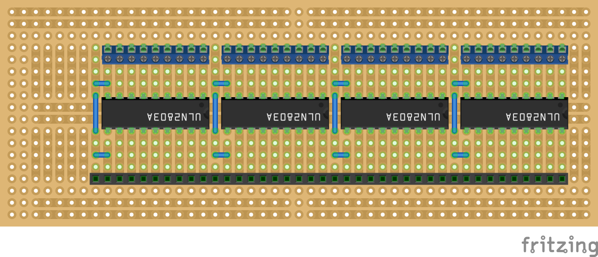

# BlockDetection

|Schematic / PCB|
|:---:|
||
||

* Fritzing files:
  * [BlockDetection_InputDriver.fzz](./BlockDetection_InputDriver.fzz)
* Component
  * [ULN2803A Eight Darlington arrays v.nr: 40ULN2003A](https://el-supply.dk/shop/85-andre-integrerede-kredse/60530-uln2003a-darl-tttlcmos-ua9667pc-dil16/)
    * [datasheet](https://www.st.com/resource/en/datasheet/uln2801a.pdf)
  * [Stripboard_49x18](../Stripboard/README.md)
  * [4 stk 9 pin KF128 2,54mm](https://vi.aliexpress.com/item/1005006375744486.html?spm=a2g0o.order_list.order_list_main.106.2f771802hZU7u1&gatewayAdapt=glo2vnm)
  * [1 stk 40 PIN Single Row Right Angle FEMALE PIN HEADER 2.54MM PITCH](https://vi.aliexpress.com/item/32980998451.html?spm=a2g0o.order_list.order_list_main.54.2f771802hZU7u1&gatewayAdapt=glo2vnm)

## Princip diagram

## Installation i Hjulby

