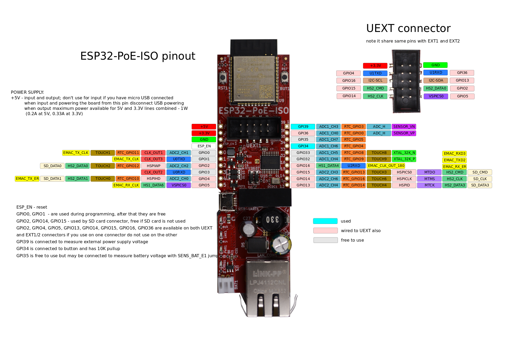
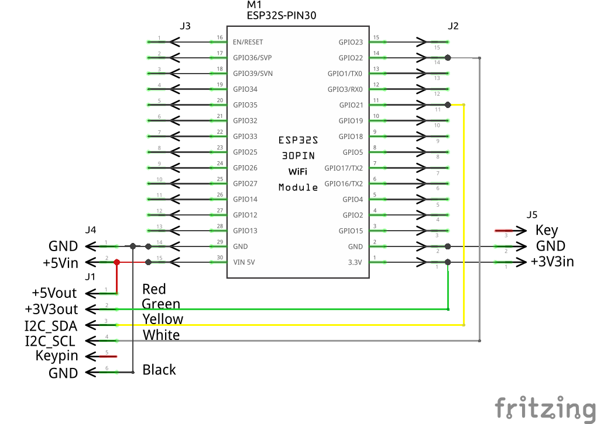
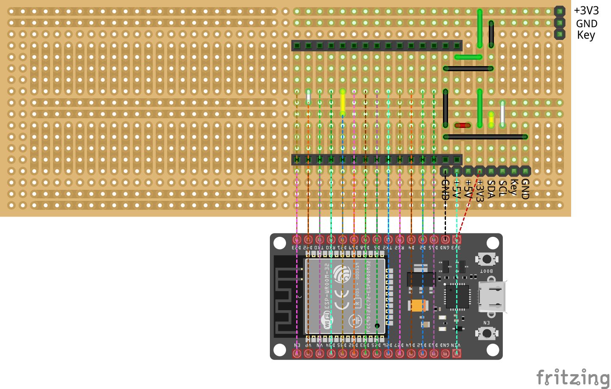
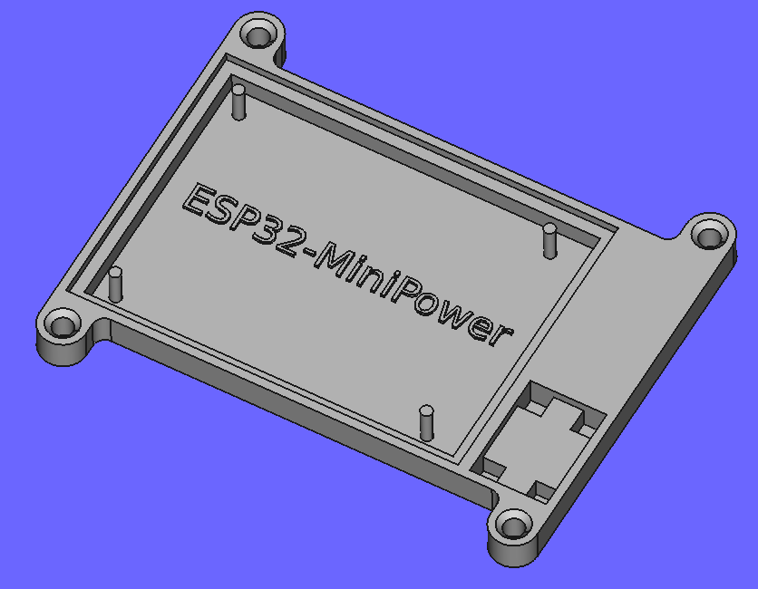

# Cpu

## [Olimex ESP32-POE-ISO-16MB](https://www.olimex.com/Products/IoT/ESP32/ESP32-POE-ISO/open-source-hardware)

Jeg er nu begyndt at bruge Olimex ESP32-POE-ISO-16MB som min basis ESP for modelbanen, da den har Ethernet interface og USB stik, jeg har valgt 16MB versionen da det giver mig muglig hed for mere end 272 I/O interface via [I2C BUS](https://esphome.io/components/i2c.html), på en processor, så noget tyder på at vi kan nøjes med en ESP pr. station.

* [Olimex ESP32](https://www.olimex.com/Products/IoT/ESP32/)
  * [Olimex ESP32-POE-ISO-16MB](https://www.olimex.com/Products/IoT/ESP32/ESP32-POE-ISO/open-source-hardware)
* [I2C BUS](https://esphome.io/components/i2c.html)
  * 128 GP I/O via [8 stk. MCP23017](https://esphome.io/components/mcp230xx#mcp23017-label)
  * 144 PWM Output via [9 stk. PCA9685](https://esphome.io/components/output/pca9685)

|ESP32-POE-ISO-GPIO|
|:---:|
||

|ESP32-POE-ISO-revision-J-dimensions|
|:---:|
||

|FreeCAD Files|
|:---:|
||

* FreeCAD Files
  * [Olimex-ESP32-POE-ISO.FCStd](./Olimex_ESP32-POE-ISO/Olimex-ESP32-POE-ISO.FCStd)
  * [Olimex-ESP32-POE-ISO-Body.3mf](./Olimex_ESP32-POE-ISO/Olimex-ESP32-POE-ISO-Body.3mf)

## Prototype

### ESP32-Dev 30Pin med I2C Interface - 5V PowerSupply

|Schematic|
|:---:|
||

|Breadboard|
|:---:|
||

* Fritzing files:
  * [ESP32_30Pin_I2C_Board_a.fzz](./ESP32_30Pin_I2C_Board_a/ESP32_30Pin_I2C_Board_a.fzz)

#### Forskellige måder at bruge dette print på

* Version 1 - 5V forsyning:
  * Tilslut 5V til J4
  * Forbind I2C interface via J1
  * NB! Der må ikke tilsluttes 3V3 til J5
* Version 2 - 3V3 forsyning:
  * Tilslut 3V3 til J5
  * Forbind I2C interface via J1
  * NB! Der må ikke tilsluttes 5V til J1
  * Denne løsning bruges lige nu sammen med [SporskifterDriver Printet](../SporskifteDriver/README.md).

#### Montage plade for ESP32-Dev 30Pin med I2C Interface og 5V Mini DC-DC Converter

|Esp32-MiniPow_Dev|Esp32-Dev|
|:---:|:---:|
||

* FreeCAD files:
  * [Esp32-MiniPow_Dev.FCStd](./ESP32_30Pin_I2C_Board_a/FreeCAD-Files/Esp32-MiniPow_Dev.FCStd)
  * [Esp32-MiniPow_Dev-Body.3mf](./ESP32_30Pin_I2C_Board_a/FreeCAD-Files/Esp32-MiniPow_Dev-Body.3mf)
  * [Esp32-Dev.FCStd](./ESP32_30Pin_I2C_Board_a/FreeCAD-Files/Esp32-Dev.FCStd)
  * [Esp32-Dev-Body.3mf](./ESP32_30Pin_I2C_Board_a/FreeCAD-Files/Esp32-Dev-Body.3mf)
