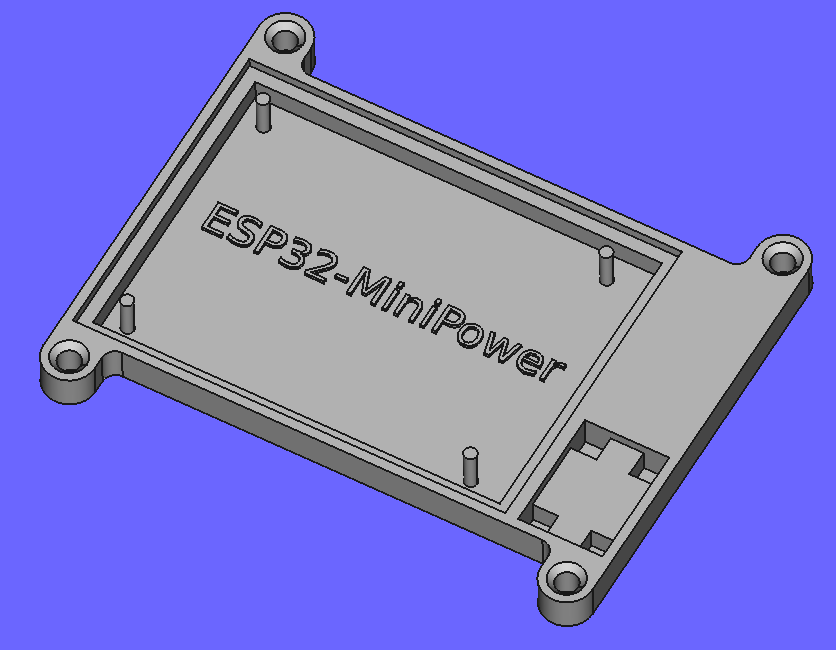

# Cpu

## ESP32-Dev 30Pin med I2C Interface

|Schematic|
|:---:|
||

|Breadboard|
|:---:|
||

* Fritzing files:
  * [ESP32_30Pin_I2C_Board_a.fzz](./ESP32_30Pin_I2C_Board_a.fzz)

### Forskellige måder at bruge dette print på

* Version 1 - 5V forsyning:
  * Tilslut 5V til J4
  * Forbind I2C interface via J1
  * NB! Der må ikke tilsluttes 3V3 til J5
* Version 2 - 3V3 forsyning:
  * Tilslut 3V3 til J5
  * Forbind I2C interface via J1
  * NB! Der må ikke tilsluttes 5V til J1
  * Denne løsning bruges lige nu sammen med [SporskifterDriver Printet](../SporskifteDriver/README.md).

### Montage plade for ESP32-Dev 30Pin med I2C Interface og 5V Mini DC-DC Converter

|Esp32-MiniPow_Dev|
|:---:|
||

* FreeCAD files:
  * [Esp32-MiniPow_Dev.FCStd](./FreeCAD-Files/Esp32-MiniPow_Dev.FCStd)
  * [Esp32-MiniPow_Dev-Body.3mf](./FreeCAD-Files/Esp32-MiniPow_Dev-Body.3mf)
