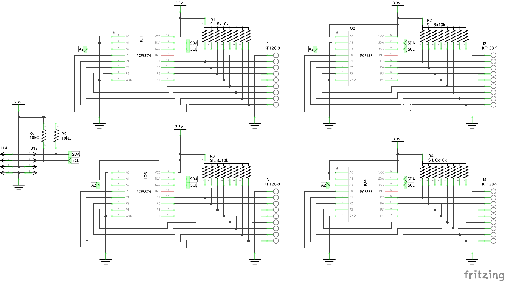
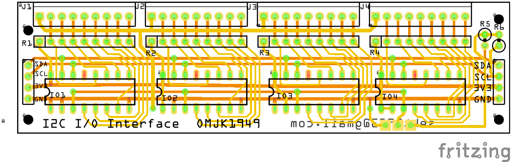

# I2C IO_Interface

|Schematic / PCB|
|:---:|
||
||

* Fritzing files:
  * [I2C_IO_Interface.fzz](./I2C_IO_Interface.fzz)
  * [bom](./I2C_IO_Interface_bom.html)
  * [svg files](./svg_I2C_IO_Interface/)
