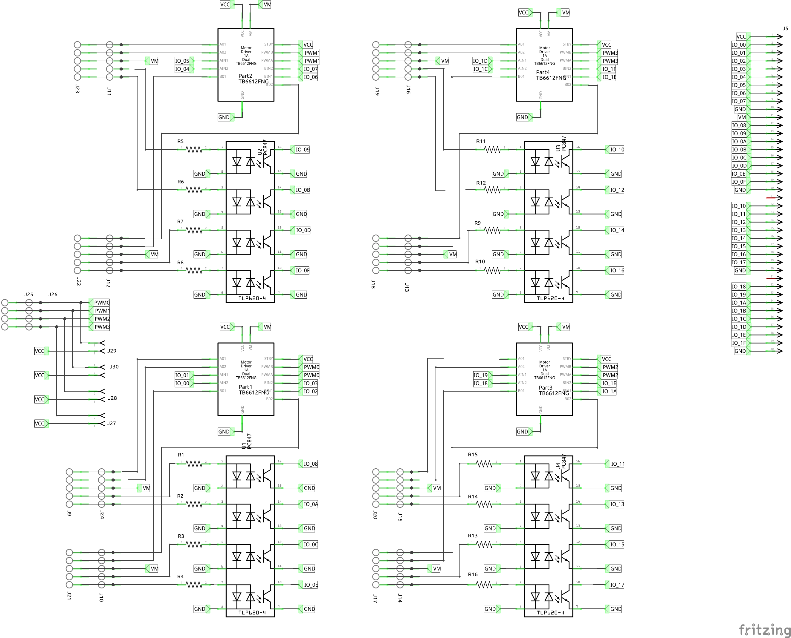
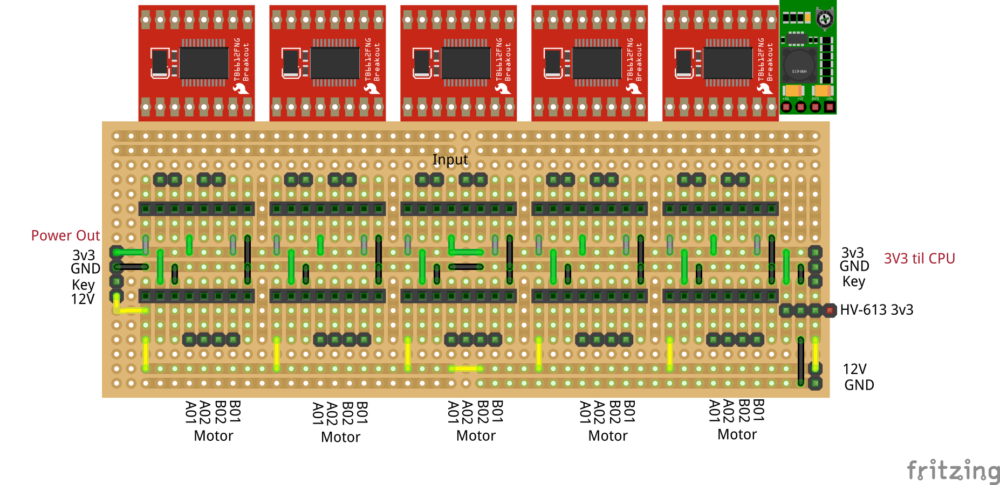

# Sporskifte Driver med TB6612FNG for Tortoise Point Motors

## SporskifteDriver_002 med PWM control

|Fritzing Schematic|
|:---|
||
|Fritzing PCB|
||

* Fritzing files:
  * [SporskifteDriver_002.fzz](./SporskifteDriver_002/SporskifteDriver_002.fzz)
* Datasheet:
  * [TB6612FNG](https://www.sparkfun.com/datasheets/Robotics/TB6612FNG.pdf)
  * [TORTOISE Sporskifte motor](./Doc/800-6000ins.pdf)
    

## Prototype

|Fritzing Breadboard|
|:---:|
||

* Fritzing files:
  * [TB6612FNG_10DC.fzz](./Prototype/TB6612FNG_10DC.fzz)
