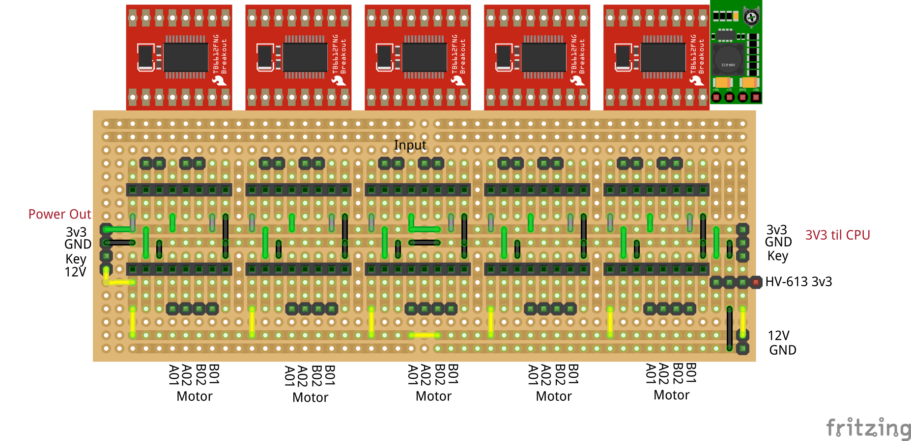
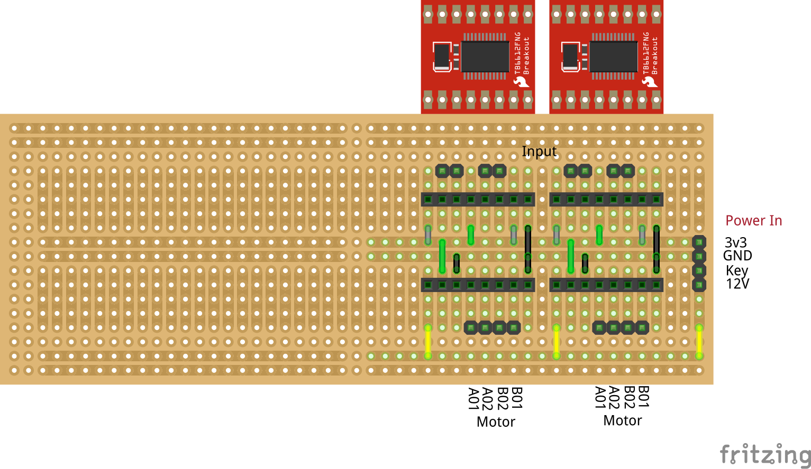
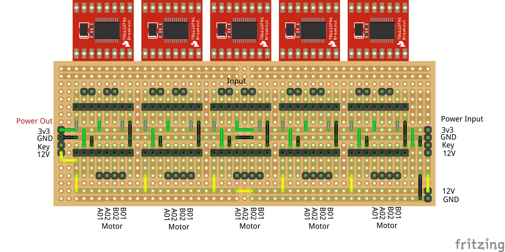

# Sporskifte Driver med TB6612FNG for Tortoise Point Motors

* Datasheet:
  * [TB6612FNG](https://www.sparkfun.com/datasheets/Robotics/TB6612FNG.pdf)
  * [HV-613 DC-DC Converter](https://www.sigmaelectronica.net/producto/hw-613/)
  * [Stripboard_49x18](../Stripboard/README.md)
  
## Grundmodul for 10 sporskifte driver med 3V3 DC-DC Converter

|Breadboard|
|:---:|
||

* Fritzing files:
  * [TB6612FNG_10DC.fzz](./TB6612FNG_10DC.fzz)

### Udvidelsesmodul for 4 sporskifte driver

|Breadboard|
|:---:|
||

* Fritzing files:
  * [TB6612FNG_04.fzz](./TB6612FNG_04.fzz)

### Udvidelsesmodul for 10 sporskifte driver

|Breadboard|
|:---:|
||

* Fritzing files:
  * [TB6612FNG_10.fzz](./TB6612FNG_10.fzz)

## Sådan forbindes disse kort

* For alle modeller bruges:
  * For motor tilslutning af 2 motore [4 polet Molexstik han vinkel 5556.04A](https://el-supply.dk/shop/282-molexstik-han-vinkel/63950-4pl-pinraekke-mflig-vinkel-mod-254/)
  * For forbindelse til [I2C IO_Interface-SporskifteDriver](../I2C%20IO_Interface/README.md) bruges [5 polet Molexstik han vinkel 5556.05A](https://el-supply.dk/shop/282-molexstik-han-vinkel/63952-5pl-pinraekke-mflig-vinkel-mod-254/) hvor midterbenet fjernes.
  * Crimpterminaler med ledning for moles stik bruges:
    * [GND - Sort - 5594.0](https://el-supply.dk/shop/280-crimpterminaler-med-ledning/64095-ledning-med-crimpterminal-30cm-sort/)
    * [12V - Orange - 5594.3](https://el-supply.dk/shop/280-crimpterminaler-med-ledning/64098-ledning-med-crimpterminal-30cm-orange/)
    * [3V3 - Grøn - 5594.5](https://el-supply.dk/shop/280-crimpterminaler-med-ledning/64100-ledning-med-crimpterminal-30cm-groen/)
* Grundmodul for 10 sporskifte driver med 3V3 DC-DC Converter:
  * For 12V power in  bruges et [2 polet Molexstik han vinkel 5556.02A](https://el-supply.dk/shop/282-molexstik-han-vinkel/63945-2pl-pinraekke-mflig-vinkel-mod-254/)
  * For 3V3 Power Out til CPU mudul bruges [3 Polet Molexstik han vinkel 5556.03A](https://el-supply.dk/shop/282-molexstik-han-vinkel/63948-3pl-pinraekke-mflig-vinkel-mod-254/)
  * For tilslutning af udvidelse kort bruges [4 Polet Molexstik han vinkel 5556.04A](https://el-supply.dk/shop/282-molexstik-han-vinkel/63950-4pl-pinraekke-mflig-vinkel-mod-254/)
* Udvidelsesmodul for 4 sporskifte driver:
  * For PowerInd bruges [4 Polet Molexstik han vinkel 5556.04A](https://el-supply.dk/shop/282-molexstik-han-vinkel/63950-4pl-pinraekke-mflig-vinkel-mod-254/)
* Udvidelsesmodul for 10 sporskifte driver:
  * For Power bruges [4 Polet Molexstik han vinkel 5556.04A](https://el-supply.dk/shop/282-molexstik-han-vinkel/63950-4pl-pinraekke-mflig-vinkel-mod-254/)
