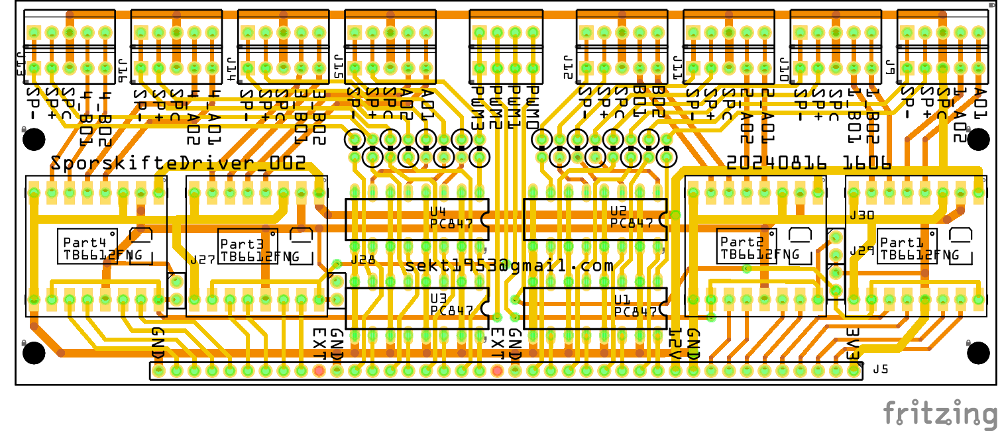

# Sporskifte Driver med TB6612FNG for Tortoise Point Motors

## SporskifteDriver_002 med PWM control

|Fritzing Schematic|
|:---|
||
|Fritzing PCB|
||
|TORTOISE Sporskifte motor|
||

|TORTOISE Pins:|Sporskifte A|Sporskifte B|
|---:|:---:|:---:|
|1|A01|B02|
|2|SP-|SP-|
|3|SP+|SP+|
|4|SPC|SPC|
|5|Hjertestykke|Hjertestykke|
|6|||
|7|||
|8|A02|B01|

* Fritzing files:
  * [SporskifteDriver_002.fzz](./SporskifteDriver_002/SporskifteDriver_002.fzz)
* Datasheet:
  * [TB6612FNG](https://www.sparkfun.com/datasheets/Robotics/TB6612FNG.pdf)
  * [TORTOISE Sporskifte motor](./Doc/800-6000ins.pdf)

## Entry Table for Sporskitedriver

### Hjulby (Ju) mod Tommerup (Tp)

|Enhed|type|101+|101-|102+|102-|103+|103-|S1+|S1-|
|:---|:---|:---|:---|:---|:---|:---|---|:---|:---|
|Trigger|binary_sensor|ju_udvendig_betjeningsskab_00||||||||
|Motor_A+|Switch|ju_sp_tp_101a1||||||||
|Motor_A-|Switch|ju_sp_tp_101a2||||||||
|Motor_A_SP+|binary_sensor|ju_sp_tp_28||||||||
|Motor_A_SP-|binary_sensor|ju_sp_tp_2a||||||||
|Motor_B+|Switch|ju_sp_tp_101b2||||||||
|Motor_B-|Switch|ju_sp_tp_101b1||||||||
|Motor_B_SP+|binary_sensor|ju_sp_tp_2c||||||||
|Motor_B_SP-|binary_sensor|ju_sp_tp_2e||||||||
|Led_A+|light|ju_udvendig_betjeningsskab_section_03|||||
|Led_B+|light|ju_udvendig_betjeningsskab_section_01|||||
|Led_AB-|light|ju_udvendig_betjeningsskab_section_02|||||

## Prototype

|Fritzing Breadboard|
|:---:|
||

* Fritzing files:
  * [TB6612FNG_10DC.fzz](./Prototype/TB6612FNG_10DC.fzz)
