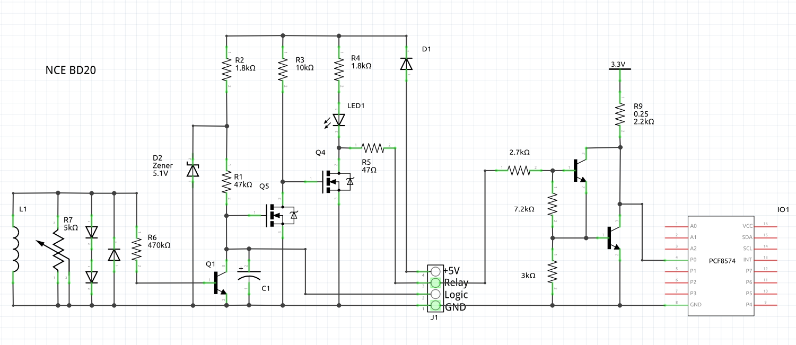
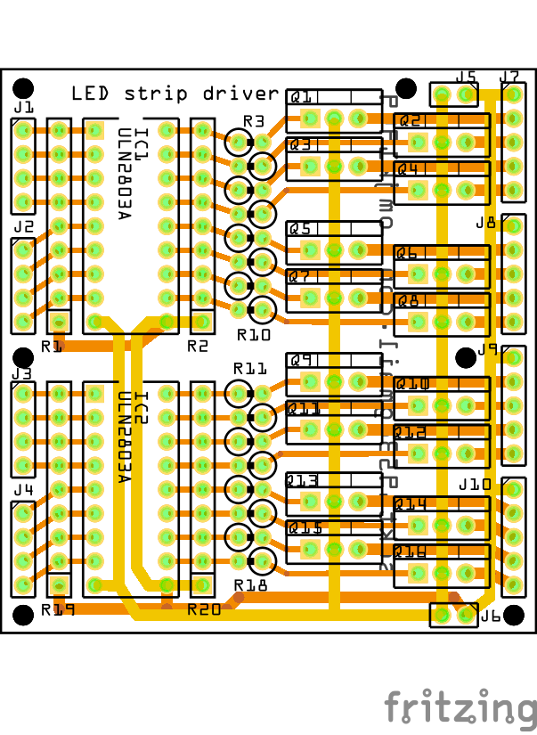

# ESPHome

## Kilde

* [ESPHome.io](https://esphome.io/)

## Configuration

### File structure

```data
/CONFIG/
  esphome/
    secrets.yaml
```

### Basic Configuration

* Just to be clear, passwords are not the ones used, only here to show how they should look when you bother some new ones

#### /CONFIG/esphome/secrets.yaml

```yaml
# SSID & PASSWORD for local-wifi
# omjk
wifi_ssid_omjk: "wifi_ssid_omjk"
wifi_password_omjk: "wifi_password_omjk"

# Secure Password Generator: https://passwordsgenerator.net/
# omjk
api_password_omjk: "F7SHdwmg36pGvKxc2juNnzPRU9BQ5ytZ"
ota_pass_omjk: "F7SHdwmg36pGvKxc2juNnzPRU9BQ5ytZ"
ap_password_omjk: "pjF79PSmRN6t5cL3"

# 32Byte Base64 String https://generate.plus/en/base64
api_key_omjk: "LTMfTQ2GwmBURmIWOL3Czw=="

```

## PCB

### ESP32 MCU

#### I2C_IO_Interface with 4xPCF8574

* 
  * Fritzing PCB file: [I2C_IO_Interface.fzz](https://github.com/sekt1953/Fritzing/blob/main/My_PCB/Modeltog/Block_Detecsion/I2C_%20IO_Interface.fzz)
  * FreeCAD files: [PCA9685.FCStd](https://github.com/sekt1953/FreeCAD/blob/main/PCA9685/PCA9685.FCStd), [PCA9685_SolderMount.FCStd](https://github.com/sekt1953/FreeCAD/blob/main/PCA9685/PCA9685_SolderMount.FCStd)

##### Block Detecsion with 8xBD20, ULN2803 & I2C_IO_Interface

* Block Detecsion Files:
  * ESPHome Files:
    * [I2C_IO_PCF8574.yaml](./I2C_IO_PCF8574/I2C_IO_PCF8574.yaml)
    * [.pcf8574_ids.yaml](./I2C_IO_PCF8574/.pcf8574_ids.yaml)
    * [.pcf8574_input.yaml](./I2C_IO_PCF8574/.pcf8574_input.yaml)
  * Fritzing Files:
    * NCE 5240205 Block Detector BD20:
      * 
      * [Tony's Train Change](https://tonystrains.com/product/nce-5240205-block-detector-bd20)
      * [NCE-BD20-Manual](https://www.dccconcepts.com/manual/nce-owners-manual-bd20-block-detector/nce-bd20-manual-2/)
    * BD20, ULN2803A & I2C_IO_PCF8574
      * 

##### Block Detecsion with 12xDiode Interface

#### Led Driver with PCA9685

* PWM with pca9685
  * 
  * ESPHome Files:
    * [/pca9685-xx.yaml](./pca9685-00.yaml)
  * FreeCAD files:
    * [Mount for PCA9685 PCB](https://github.com/sekt1953/FreeCAD#mount-for-pca9685-pcb)

##### Led Strip Driver with 2xULN2803A & 16xIRLZ44

* PWM LED Strip Driver
  * Fritzing Files: [PWM LED Strip Driver](https://github.com/sekt1953/Fritzing/blob/main/My_PCB/Modeltog/LedStripDriver/README.md)
    * 

##### Led Driver with optocupler

* Leddriver Files:
  * ESPHome files:
    * [leddriver-xx.yaml](./leddriver-xx.yaml)
  * Fritzing Files;
    * [PCB-LedDriver-V6.1.fzz](https://github.com/sekt1953/Fritzing/blob/main/My_PCB/LedDriver/v6.1/PCB-LedDriver-V6.1.fzz)
  * FreeCAD Files:
    * [LedDriverv6.1a.FCStd](https://github.com/sekt1953/FreeCAD/blob/main/LeadDriverv6.1/LedDriverv6.1a.FCStd)
