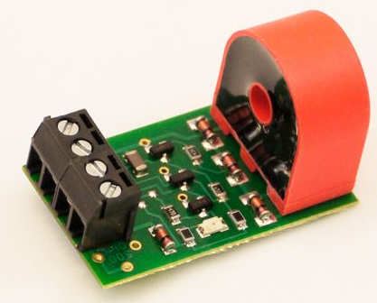

# ESPHome

## Kilde

* [ESPHome.io](https://esphome.io/)

## Configuration

### File structure

```data
/CONFIG/
  esphome/
    secrets.yaml
```

### Basic Configuration

* Just to be clear, passwords are not the ones used, only here to show how they should look when you bother some new ones

#### /CONFIG/esphome/secrets.yaml

```yaml
# SSID & PASSWORD for local-wifi
# omjk
wifi_ssid_omjk: "wifi_ssid_omjk"
wifi_password_omjk: "wifi_password_omjk"

# Secure Password Generator: https://passwordsgenerator.net/
# omjk
api_password_omjk: "F7SHdwmg36pGvKxc2juNnzPRU9BQ5ytZ"
ota_pass_omjk: "F7SHdwmg36pGvKxc2juNnzPRU9BQ5ytZ"
ap_password_omjk: "pjF79PSmRN6t5cL3"

# 32Byte Base64 String https://generate.plus/en/base64
api_key_omjk: "LTMfTQ2GwmBURmIWOL3Czw=="

```

## Software

### ESP32 MCU

#### I2C_IO_Interface with 4xPCF8574

* 

##### Block Detecsion with 8xBD20 interface

* OccupiedSensor Files:
  * ESPHome Files:
    * [occupied-xx.yaml](./occupied-xx.yaml)
    * [Occupied-Hp.yaml "Holmstrup"](./Occupied-Hp.yaml)
  * Fritzing Files:
    * [occupied_sensor](https://github.com/sekt1953/Fritzing/blob/main/My_PCB/README.md#occupied_sensor-work-in-progress)
    * 

##### Block Detecsion with 12xDiode Interface

#### Led Driver with PCA9685

* PWM with pca9685
  * 
  * ESPHome Files:
    * [/pca9685-xx.yaml](./pca9685-00.yaml)
  * FreeCAD files:
    * [Mount for PCA9685 PCB](https://github.com/sekt1953/FreeCAD#mount-for-pca9685-pcb)

##### Led Strip Driver with 2xULN2803A & 16xIRLZ44

* PWM LED Strip Driver
  * Fritzing Files:
    * [PWM LED Strip Driver](https://github.com/sekt1953/Fritzing/blob/main/My_PCB/Modeltog/LedStripDriver/README.md)
    * 

##### Led Driver with optocupler

* Leddriver Files:
  * ESPHome files:
    * [leddriver-xx.yaml](./leddriver-xx.yaml)
  * Fritzing Files;
    * [PCB-LedDriver-V6.1.fzz](https://github.com/sekt1953/Fritzing/blob/main/My_PCB/LedDriver/v6.1/PCB-LedDriver-V6.1.fzz)
  * FreeCAD Files:
    * [LedDriverv6.1a.FCStd](https://github.com/sekt1953/FreeCAD/blob/main/LeadDriverv6.1/LedDriverv6.1a.FCStd)
