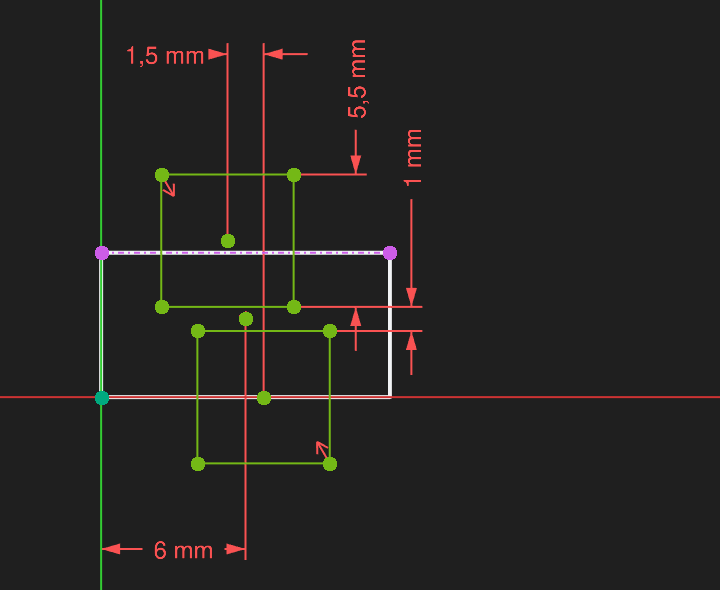

# Standarder for Centrabetjeningspanel tegning

## LED

* SK6812_5050
  * Glas Sporskifte stilling
    * Længde: 5,5mm
    * Højde: 4,2mm
    * Pocket: 2,0mm
    * Pad: 1,5mm
    * Z: 0,0mm
  * Glas SporIsolation
    * Længde: 5,5mm
    * Højde: 5,5mm
    * Pocket: 2,0mm
    * Z: -2,0mm
  * Led 
    * Længde: 5,5mm
    * Højde: 5,5mm
    * Pocket: 2,0mm
    * Z: -4,0mm

## Trykknapper

* Rund trykkanp
  * 7mm
    * Hul diameter: 6,5
  * 5mm 
    * Hul diameter: 4,2
* Firkantet tact
  * 6x6mm
    * Trykknap
      * diameter: 6,5mm
      * Pad: 10mm
      * Z: -1,5mm
    * Octogon
      * diameter: 7,04mm
      * Pad: -3,0mm
      * Z: -3,0mm
    * Firkant
      * Bredde: 6,2mm
      * Pad: -2,0mm
      * Z: -4,0mm

## Blok indikering

||||||
|:---:|:---:|:---:|:---:|:---:|
||||||

* How to
  * Belysning:
    * LED: SK6812_5050_RGBWW
    * Montage: hjemmelavet print
  * Layer
    * Position Z:  
      * Base: 0,00mm
      * Led: 3,00mm
      * Glas: 5,00mm
    * Pad
      * Base:
        * Length: 6,00mm
        * Reversed: No
      * Led:
        * Length: 3,00mm
        * Reversed: Yes
      * Glas:
        * Length: 1,00mm
        * Reversed: No
    * AdditiveLoft:
      * Layer:
        * Led
        * Glas
