# Standarder for Centrabetjeningspanel tegning

## Trykknapper

### Trykknap 6x6

|Knap|Octogon|Tryk|3D Layer|Total|
|:---:|:---:|:---:|:---:|:---:|
|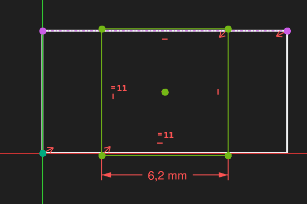|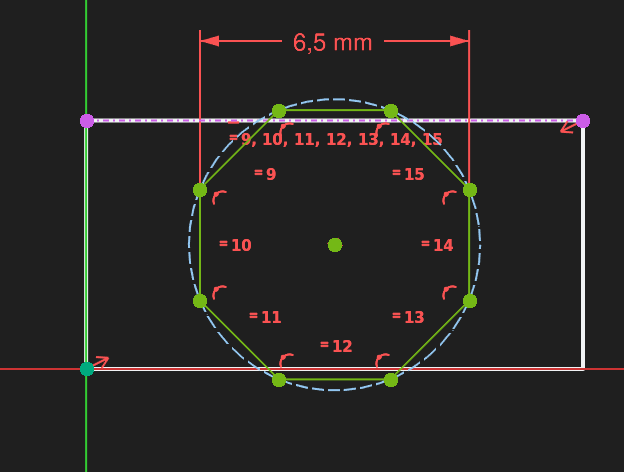|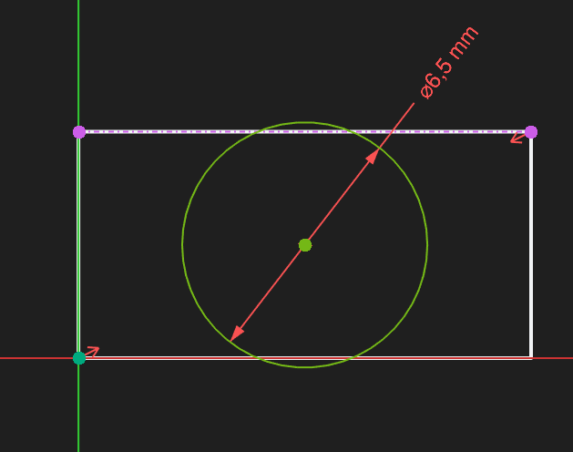|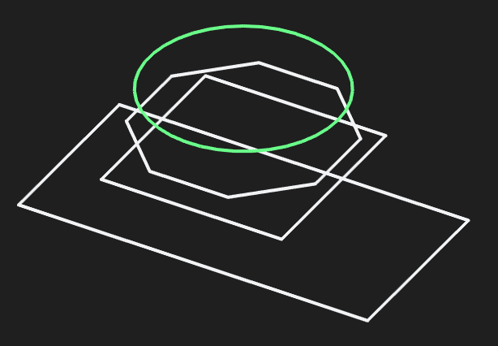|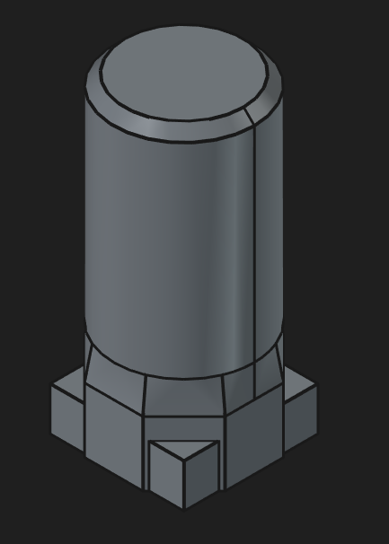|

* FreeCAD File:
  * [Trykknapper.FCStd](./Trykknapper.FCStd)
* Firkantet tact
  * 6x6mm
    * Trykknap
      * diameter: 6,5mm
      * Pad: 10mm
      * Z: -1,5mm
    * Octogon
      * diameter: 7,04mm
      * Pad: -3,0mm
      * Z: -3,0mm
    * Firkant
      * Bredde: 6,2mm
      * Pad: -2,0mm
      * Z: -4,0mm

## LED

* SK6812_5050
  * [DataSheet](https://cdn-shop.adafruit.com/product-files/2757/p2757_SK6812RGBW_REV01.pdf "Adafruit.com")

|Mechanical Dimensions|Pin Configuration|Typical Application Circuit|
|:---:|:---:|:---:|
|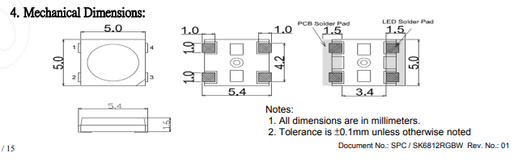||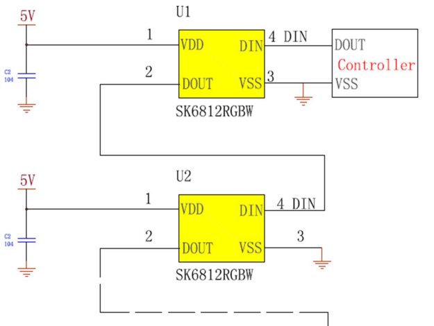

### Blok indikering

Denne model bruges til at lave hul i frontpladen for blok indikering.  
Den Klones i **FreCAD Part Design** med **Clone** funktionen  
Anbringes det rigtige sted på sporplanen,  
i **FreeCAD Part** kan bruges sammen med **Union** & **Cut** funktionen.

#### Blok indikering v1

|PCB Layer|Led Layer|Frirum|Glas Layer|Layer 3D|Total|
|:---:|:---:|:---:|:---:|:---:|:---:|
||||||
|Z: 0,0mm|Z: 1,5mm|Z: 3,0mm|Z: 5,0mm|||
|Pad: 1,5mm|Pad: 1,5mm|AdditiveLoft|Pad: 1,0mm|||
|||Frirum/Glas||||

* FreeCAD File: 
  * [BlokIndikering_v1.FCStd](./BlokIndikering_v1.FCStd)

#### Blok indikering v2

|PCB|Led Layer|Led Layer2|Glas Layer|Layer 3D|Total|
|:---:|:---:|:---:|:---:|:---:|:---:|
|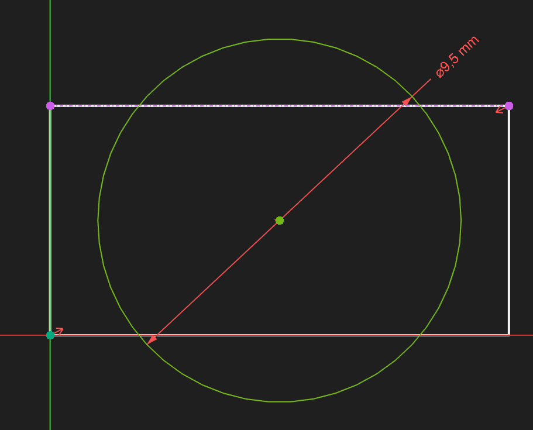|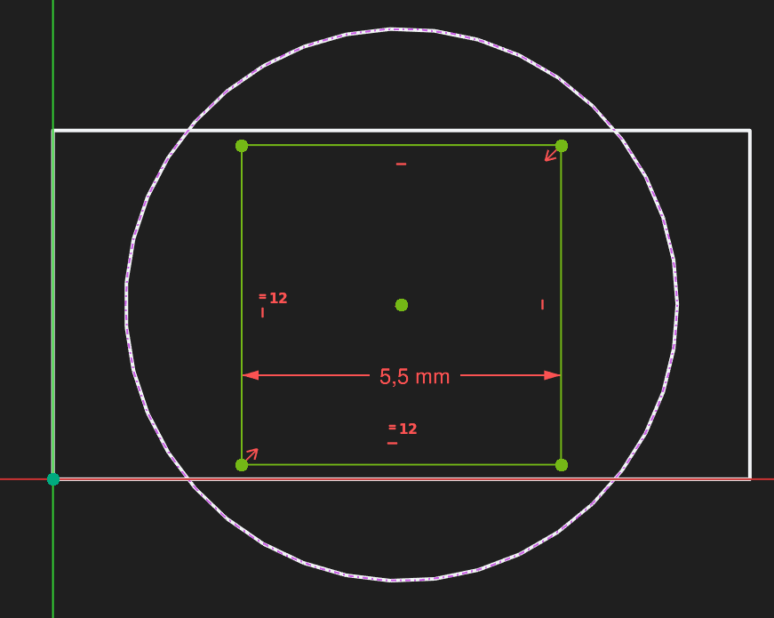|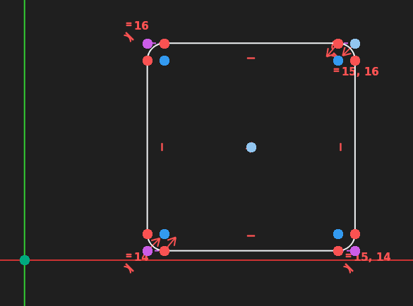|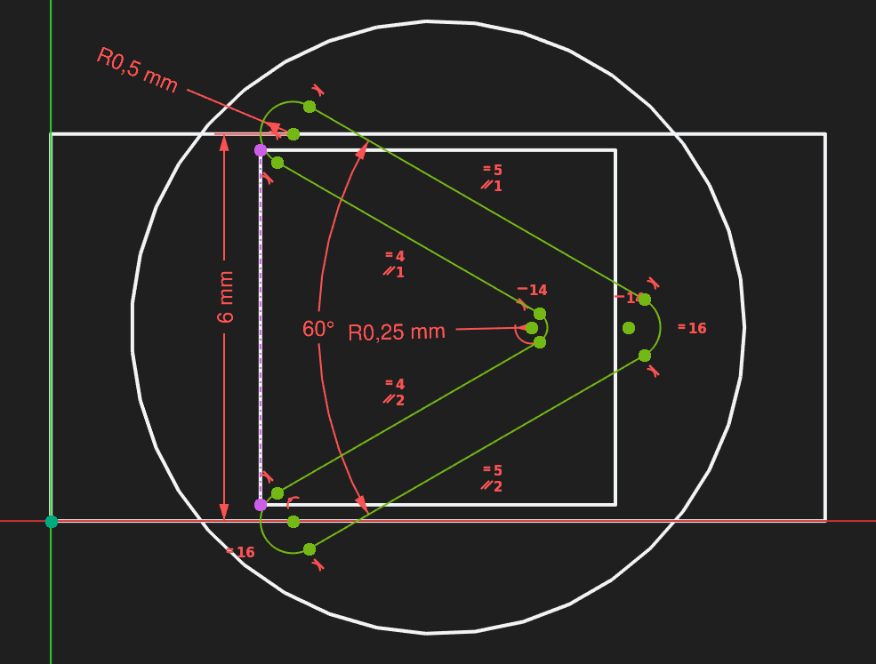|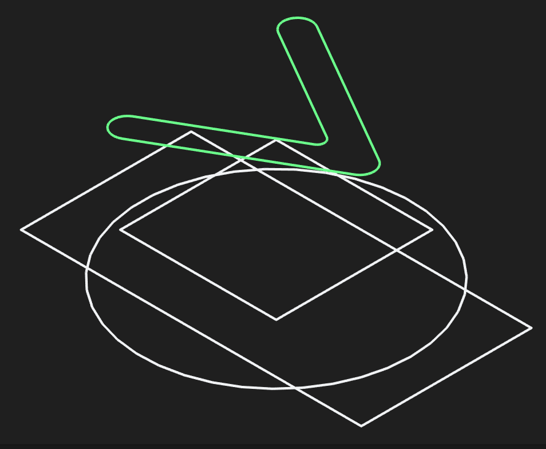|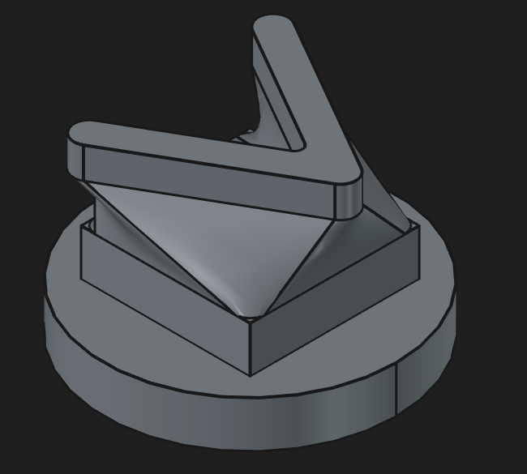|

* FreeCAD File: 
  * [BlockSignal.FCStd](./BlockSignal.FCStd) 
* How to
  * Belysning:
    * LED: SK6812_5050_RGBWW
    * Montage: hjemmelavet print
  * Layer
    * Position Z:  
      * Base: 0,00mm
      * PCB: 0,00mm
      * Led: 3,00mm
      * Led2: 3,00mm
      * Glas: 5,00mm
    * Pad
      * Base:
        * Length: 6,00mm
        * Reversed: No
      * PCB:
        * Length: 1,50mm
        * Reversed: No
      * Led:
        * Length: 1,50mm
        * Reversed: Yes
      * Led:
        * Length: 1,50mm
        * Reversed: Yes
      * Glas:
        * Length: 0,00mm
        * Reversed: No
    * AdditiveLoft:
      * Layer:
        * Led2
        * Glas

### PU-Signal

#### Symbol

|Sketch|Body|3D|
|:---:|:---:|:---:|
||||

#### Led SK6812_5050 RGBWW

|PCB|Led 5050|Glas|3D|
|:---:|:---:|:---:|:---:|
|||||

* FreeCAD File:
  * [Pu.FCStd](./Pu.FCStd)
