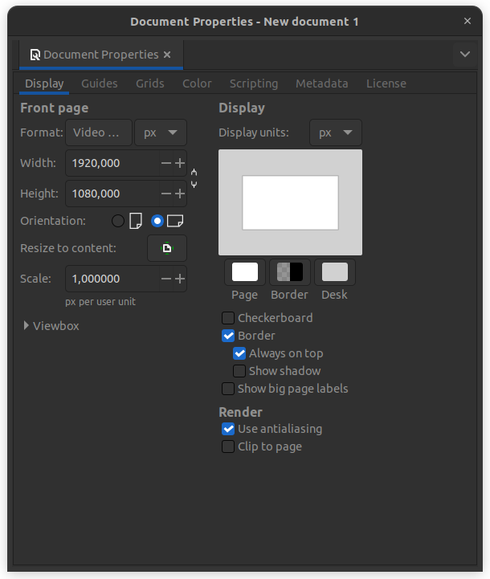
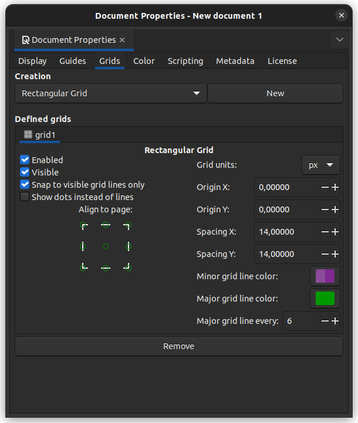

# [Inkscape](https://inkscape.org/)

## [Inkscape Tutorials](https://inkscape.org/learn/tutorials/)
* [Basic tutorial](https://inkscape.org/doc/tutorials/basic/tutorial-basic.html)
* [Shapes tutorial](https://inkscape.org/doc/tutorials/shapes/tutorial-shapes.html)
* [Advanced tutorial](https://inkscape.org/doc/tutorials/advanced/tutorial-advanced.html)
* [Bitmap Tracing tutorial](https://inkscape.org/doc/tutorials/tracing/tutorial-tracing.html)
* [Pixelart Tracing tutorial](https://inkscape.org/doc/tutorials/tracing-pixelart/tutorial-tracing-pixelart.html)
* [Calligraphy tutorial](https://inkscape.org/doc/tutorials/calligraphy/tutorial-calligraphy.html)
* [Interpolate tutorial](https://inkscape.org/doc/tutorials/interpolate/tutorial-interpolate.html)
* [Elements of Design tutorial](https://inkscape.org/doc/tutorials/elements/tutorial-elements.html)
* [Tips and Tricks tutorial](https://inkscape.org/doc/tutorials/tips/tutorial-tips.html)

## My Inkscape Settings

|Display properties|Grids Properties|
|:---:|:---:|
|||

* Display:
  * Front page:
    * Format: px
    * Width: 1920,000
    * Height: 1080,000
    * Scale: 1,000000 px per user unit
  * Display
    * Display units: px
    * Border
      * Always on top
      * No shadow
* Grids:
  * Grid units: px
  * Origin X: 0,00000
  * Origin Y: 0,00000
  * Spacing X: 14,00000
  * Spacing Y: 14,00000
  * Major grid line every: 6
