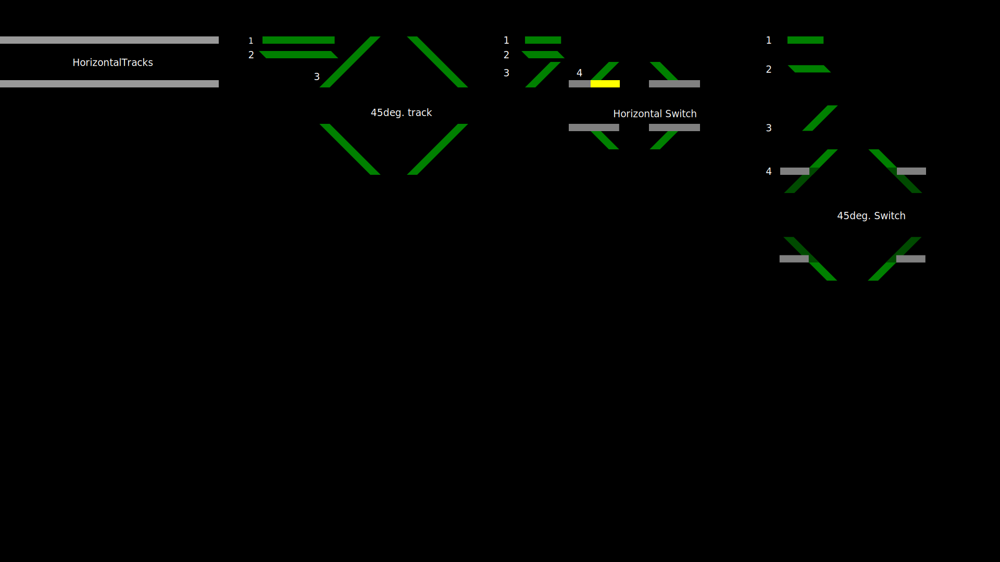
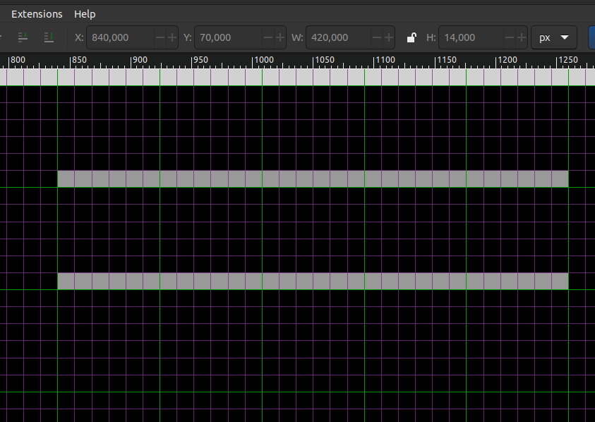
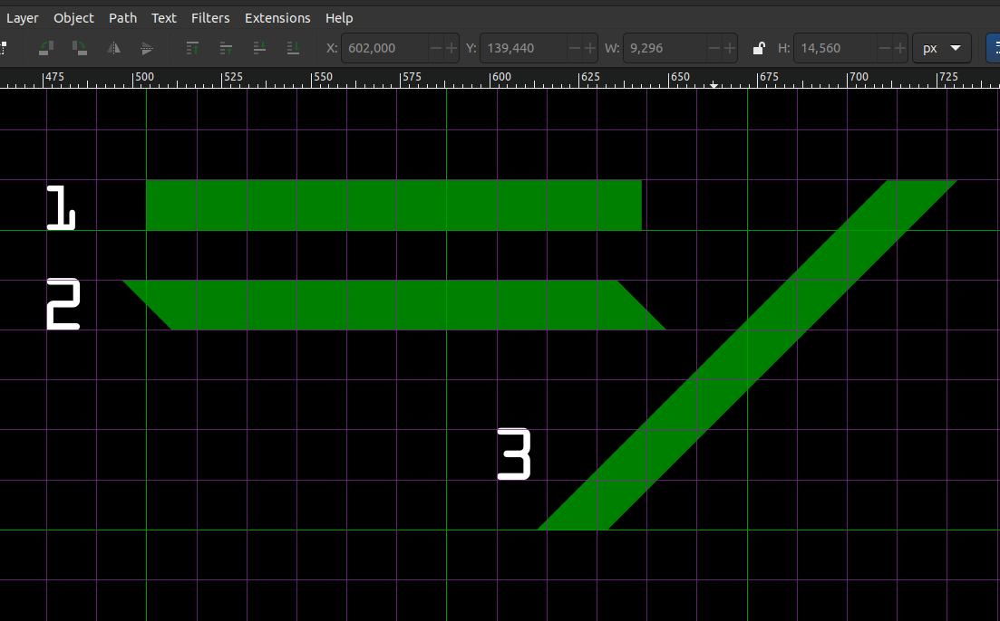
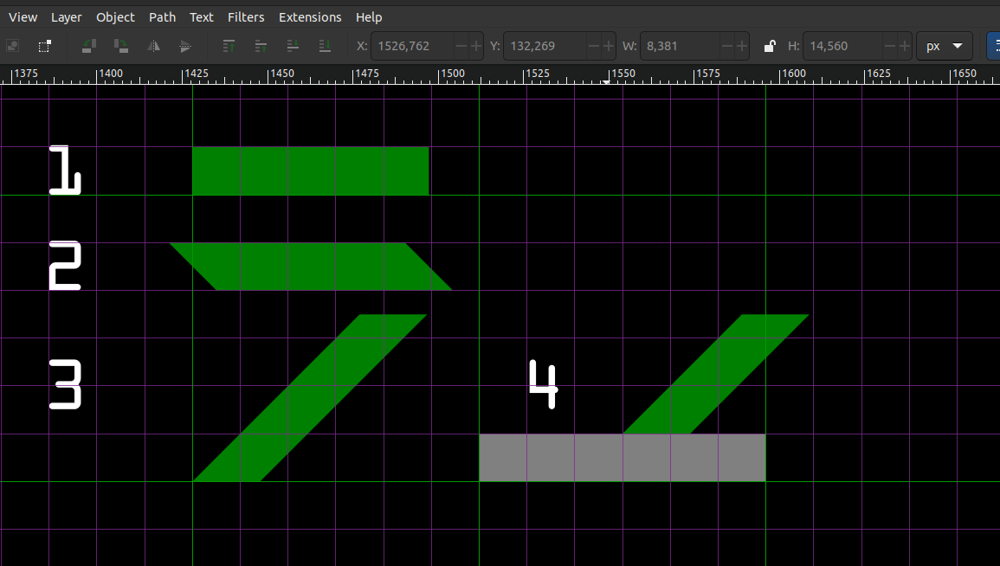
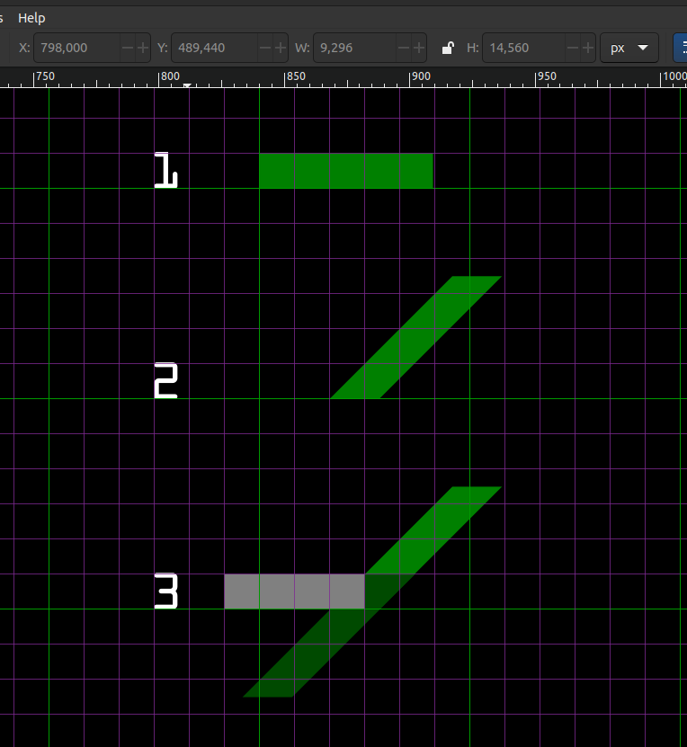

# Trackplan Building blocks

## Overview

## Horizontal tracks

* horizontal tracks:
  * Hight: 14px
  * Vertical spaceing: 84px

## 45deg. track

* 45deg. track:
  * Start with track:
    * Hight: 14px
    * Length: 138,5px
  * Transform track
    * Skew: 45deg.
    * Rotate: 45deg.

## Horizontal Switch

* 45deg. track:
  * Start with track:
    * Hight: 14px
    * Length: 69,25px
  * Transform track
    * Skew: 45deg.
    * Rotate: 45deg.
  * Moved left: 28px
* horizontal tracks:
  * Hight: 14px
  * Length: 84px

## 45deg. Switch

* 45deg. track:
  * Start with track:
    * Hight: 14px
    * Length: 69,25px
  * Transform track
    * Skew: 45deg.
    * Rotate: 45deg.
  * Start with track:
    * Hight: 14px
    * Length: 69,25px
  * Transform track
    * Skew: 45deg.
    * Rotate: 45deg.4
* horizontal tracks:
  * Hight: 14px
  * Length: 56px
