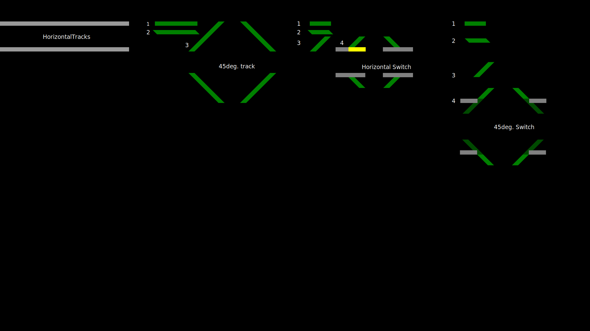

# Floorplan

## Kilde

* [TechTonor](https://www.youtube.com/@TechTonor)
  * [ha-floorplan | Home Assistant](https://www.youtube.com/playlist?list=PL5xKVw-BInX1phV-Tnjznwd2YG5mEOvWL)
    * [ha-floorplan - Getting Started (1) | Add HACS & SVG-files and YAML entity mapping in Home Assistant](https://youtu.be/5ue9J4WG2a8?list=PL5xKVw-BInX1phV-Tnjznwd2YG5mEOvWL)
    * [ha-floorplan - Create your first floorplan in Inkscape (1/2) | Including CSS and YAML configuration](https://youtu.be/f_3KAPc53hQ?list=PL5xKVw-BInX1phV-Tnjznwd2YG5mEOvWL)
      * 
    * [ha-floorplan - Using CSS-selectors | How CSS-styling works in ha-floorplan and in general](https://youtu.be/oqO4Vx6U1Mo?list=PL5xKVw-BInX1phV-Tnjznwd2YG5mEOvWL)
    * [ha-floorplan - Create your first floorplan in Inkscape (2/2) | Adv. functions, CSS-tricks and more](https://youtu.be/AmAna4McGs4?list=PL5xKVw-BInX1phV-Tnjznwd2YG5mEOvWL)
    * [ha-floorplan & JavaScript | Format time_date.time entity from military to AM/PM in state_action](https://youtu.be/GHcgwW-OOo8?list=PL5xKVw-BInX1phV-Tnjznwd2YG5mEOvWL)
  * [Home-Assistant_Attachments-for-YouTube](https://github.com/exetico/Home-Assistant_Attachments-for-YouTube/tree/main)
## Inkscape

### Settings

|Display properties|Grids Properties|
|:---:|:---:|
|||

* Display:
  * Front page:
    * Format: px
    * Width: 1920,000
    * Height: 1080,000
    * Scale: 1,000000 px per user unit
  * Display
    * Display units: px
    * Border
      * Always on top
      * No shadow
* Grids:
  * Grid units: px
  * Origin X: 0,00000
  * Origin Y: 0,00000
  * Spacing X: 14,00000
  * Spacing Y: 14,00000
  * Major grid line every: 6

## Trackplan Building blocks

### Horizontal tracks

* horizontal tracks:
  * Hight: 14px
  * Vertical spaceing: 84px

### 45deg. track

* 45deg. track:
  * Start with track:
    * Hight: 14px
    * Length: 138,5px
  * Transform track
    * Skew: 45deg.
    * Rotate: 45deg.

### Horizontal Switch

* 45deg. track:
  * Start with track:
    * Hight: 14px
    * Length: 69,25px
  * Transform track
    * Skew: 45deg.
    * Rotate: 45deg.
  * Moved left: 28px
* horizontal tracks:
  * Hight: 14px
  * Length: 84px

### 45deg. Switch

* 45deg. track:
  * Start with track:
    * Hight: 14px
    * Length: 69,25px
  * Transform track
    * Skew: 45deg.
    * Rotate: 45deg.
  * Start with track:
    * Hight: 14px
    * Length: 69,25px
  * Transform track
    * Skew: 45deg.
    * Rotate: 45deg.4
* horizontal tracks:
  * Hight: 14px
  * Length: 56px

## Trackplan Stations

### SVG files

* 
* Nyborg H
  * 
* Hjulby & Tommerup
  * 
* Odense H
  * 
  * 
* Svendborg-Holmstrup
  * 
* Midelfart
  * 
* Frederica
  * 