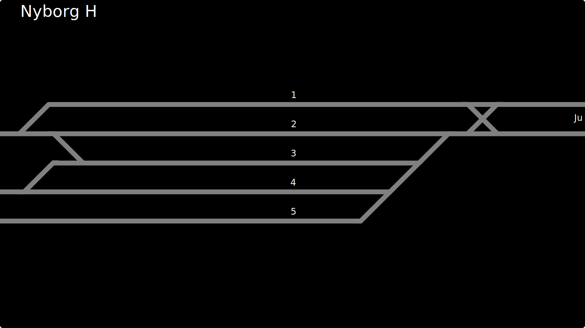
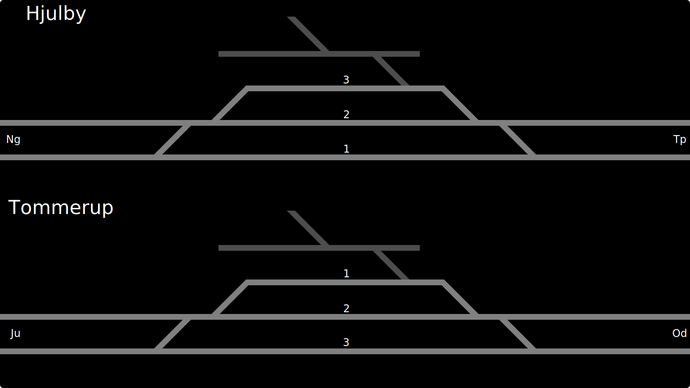

# Floorplan

## Kilde

* [TechTonor](https://www.youtube.com/@TechTonor)
  * [ha-floorplan | Home Assistant](https://www.youtube.com/playlist?list=PL5xKVw-BInX1phV-Tnjznwd2YG5mEOvWL)
    * [ha-floorplan - Getting Started (1) | Add HACS & SVG-files and YAML entity mapping in Home Assistant](https://youtu.be/5ue9J4WG2a8?list=PL5xKVw-BInX1phV-Tnjznwd2YG5mEOvWL)
    * [ha-floorplan - Create your first floorplan in Inkscape (1/2) | Including CSS and YAML configuration](https://youtu.be/f_3KAPc53hQ?list=PL5xKVw-BInX1phV-Tnjznwd2YG5mEOvWL)
    * [ha-floorplan - Using CSS-selectors | How CSS-styling works in ha-floorplan and in general](https://youtu.be/oqO4Vx6U1Mo?list=PL5xKVw-BInX1phV-Tnjznwd2YG5mEOvWL)
    * [ha-floorplan - Create your first floorplan in Inkscape (2/2) | Adv. functions, CSS-tricks and more](https://youtu.be/AmAna4McGs4?list=PL5xKVw-BInX1phV-Tnjznwd2YG5mEOvWL)
    * [ha-floorplan & JavaScript | Format time_date.time entity from military to AM/PM in state_action](https://youtu.be/GHcgwW-OOo8?list=PL5xKVw-BInX1phV-Tnjznwd2YG5mEOvWL)

## Inkscape

### Settings

|Display properties|Grids Properties|
|:---:|:---:|
|||

|Track_angle_45_01.png|Track_angle_45_02.png|
|:---:|:---:|
|||

### SVG files

* 
* Nyborg H
  * 
* Hjulby & Tommerup
  * 
* Odense H
  * 
  * 
* Svendborg-Holmstrup
  * 
* Midelfart
  * 
* Frederica
  * 