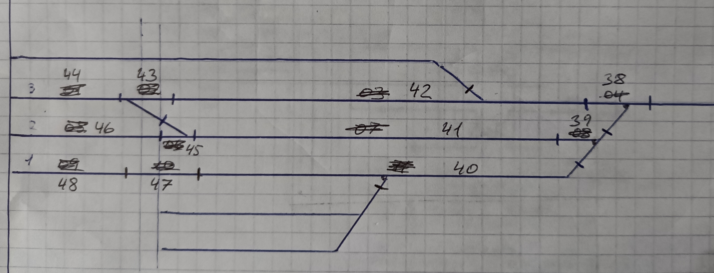

# Programering af Fredericia Station

## Fredericia Spor Isolations



### Spor Isolations Navn -> Entity_id

|Spor Isolation||BlockDetection Entity_id|Spor|Komentar|
|---:|:---|:---:|:---:|:---:|
|38|Fa-SpI-38||||
|39|Fa-SpI-39||||
|40|Fa-SpI-40||Spor1||
|41|Fa-SpI-41|binary_sensor.fa_bd_00_47|Spor2||
|42|Fa-SpI-42||Spor3||
|43|Fa-SpI-43|binary_sensor.fa_bd_00_43|Spor3|Grøn Led|
|44|Fa-SpI-44|binary_sensor.fa_bd_00_44|Spor3|Rød Led|
|45|Fa-SpI-45|binary_sensor.fa_bd_00_45|Spor2|Grøn Led|
|46|Fa-SpI-46|binary_sensor.fa_bd_00_42|Spor2|Rød Led|
|47|Fa-SpI-47|binary_sensor.fa_bd_00_41|Spor1|Grøn Led|
|48|Fa-SpI-48|binary_sensor.fa_bd_00_40|Spor1|Rød Led|

### Cap Frederica Spor Isolation Led -> Entity_id

|Name|Light.Entity_id|Komentar|
|:---:|:---:|:---:|
|Cap-Fa-SpL-43|light.cap_fa_00_01|Fa-Spor3 Grøn|
|Cap-Fa-SpL-44|light.cap_fa_00_00|Fa-Spor3 Rød|
|Cap-Fa-SpL-45|light.cap_fa_00_03|Fa-Spor2 Grøn|
|Cap-Fa-SpL-46|light.cap_fa_00_02|Fa-Spor2 Rød|
|Cap-Fa-SpL-47|light.cap_fa_00_05|Fa-Spor1 Grøn|
|Cap-Fa-SpL-48|light.cap_fa_00_04|Fa-Spor1 Rød|

## Block Detections Light Group

### Group

|Name|Entity_id|Komentar|
|:---|:---:|:---:|
|Fa-Splg-43|light.fa_splg_43|Fa-Spor3 Grøn|
|Fa-Splg-44|light.fa_splg_44|Fa-Spor3 Rød|
|Fa-Splg-45|light.fa_splg_45|Fa-Spor2 Grøn|
|Fa-Splg-46|light.fa_splg_42|Fa-Spor2 Rød|
|Fa-Splg-47|light.fa_splg_41|Fa-Spor1 Grøn|
|Fa-Splg-48|light.fa_splg_40|Fa-Spor1 Rød|

### Group Options Members

|Group|Members Name|Members Entity_id|Komentar|
|:---|:---|:---|:---|
|Fa-Splg-43|Cap-Fa-SpL-43|light.cap_fa_00_01|Fa-Spor3 Grøn|
|||light.xx||
|Fa-Splg-44|Cap-Fa-SpL-44|light.cap_fa_00_00|Fa-Spor3 Rød|
|||light.xx||
|Fa-Splg-45|Cap-Fa-SpL-45|light.cap_fa_00_03|Fa-Spor2 Grøn|
|||light.xx||
|Fa-Splg-46|Cap-Fa-SpL-46|light.cap_fa_00_02|Fa-Spor2 Rød|
|||light.xx||
|Fa-Splg-47|Cap-Fa-SpL-47|light.cap_fa_00_05|Fa-Spor1 Grøn|
|||light.xx||
|Fa-Splg-48|Cap-Fa-SpL-48|light.cap_fa_00_04|Fa-Spor1 Rød|
|||light.xx||

## Automation Fa Block Detection (YAML)

Kilde: [YAML Style Guide](https://developers.home-assistant.io/docs/documenting/yaml-style-guide/)

### Alias & Description

```yaml
alias: Fa-BD
description: Markering af hvornår toget når til enden af sporet.
```

### When (Trigger)

#### Trigger

```yaml
trigger:
```

#### Trigger Spor1

```yaml
  # Spor1
  - platform: state
    entity_id:
      - binary_sensor.fa_bd_00_41
    to: "on"
    for:
      hours: 0
      minutes: 0
      seconds: 0
    id: fa-spor1-grøn-on
  - platform: state
    entity_id:
      - binary_sensor.fa_bd_00_41
    to: "off"
    for:
      hours: 0
      minutes: 0
      seconds: 0
    id: fa-spor1-grøn-off
  - platform: state
    entity_id:
      - binary_sensor.fa_bd_00_40
    to: "on"
    for:
      hours: 0
      minutes: 0
      seconds: 0
    id: fa-spor1-rød-on
  - platform: state
    entity_id:
      - binary_sensor.fa_bd_00_40
    to: "off"
    for:
      hours: 0
      minutes: 0
      seconds: 0
    id: fa-spor1-rød-off
```

#### Trigger Spor2

```yaml

```

#### Trigger Spor3

```yaml

```

### And if

```yaml
condition:
```

### Then to

#### [action & choose](https://www.home-assistant.io/docs/automation/action/)

```yaml
action:
  - choose:
```

[#### conditions (spor1)](https://www.home-assistant.io/docs/automation/condition/)

```yaml
      # Spor1
      - conditions:
          - condition: trigger
            id:
              - fa-spor1-grøn-on
        sequence:
          - action: light.turn_on
            metadata: {}
            data:
              brightness_pct: 40
            target:
              entity_id: light.fa_spor1_bd_lg_41
      - conditions:
          - condition: trigger
            id:
              - fa-spor1-grøn-off
        sequence:
          - action: light.turn_off
            metadata: {}
            data:{}
            target:
              entity_id: light.fa_spor1_bd_lg_41
      - conditions:
          - condition: trigger
            id:
              - fa-spor1-rød-on
        sequence:
          - action: light.turn_on
            metadata: {}
            data:
              brightness_pct: 40
            target:
              entity_id: light.fa_spor1_bd_lg_40
          - action: light.turn_off
            metadata: {}
            data:{}
            target:
              entity_id: light.fa_spor1_bd_lg_41
      - conditions:
          - condition: trigger
            id:
              - fa-spor1-rød-off
        sequence:
          - action: light.turn_off
            metadata: {}
            data:{}
            target:
              entity_id: light.fa_spor1_bd_lg_40
          - action: light.turn_on
            metadata: {}
            data:
              brightness_pct: 40
            target:
              entity_id: light.fa_spor1_bd_lg_41
```

#### conditions (spor2)

```yaml

```

#### conditions (spor3)

```yaml

```

[### Mode](https://www.home-assistant.io/docs/automation/modes/)

```yaml
mode: queued
max: 10
```
