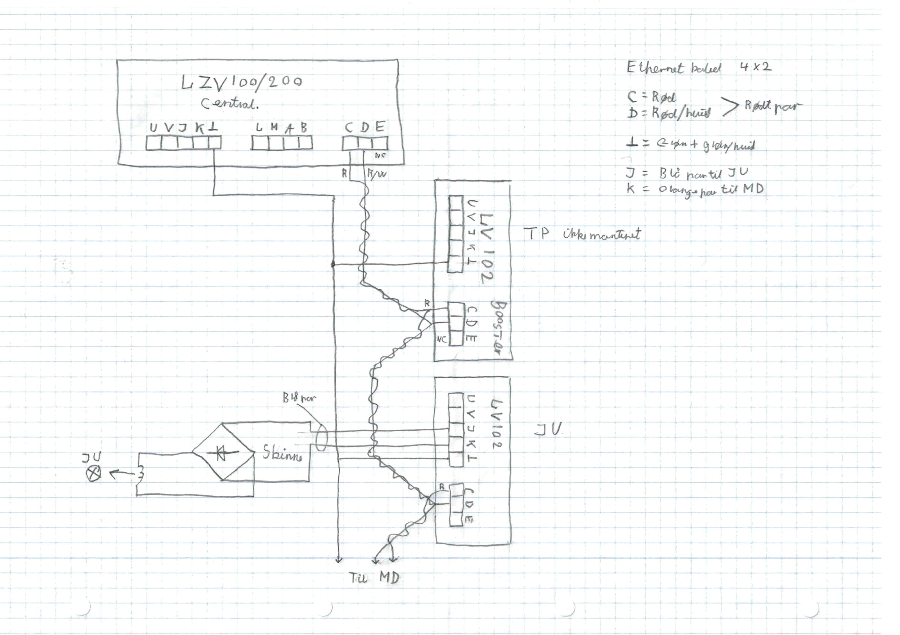
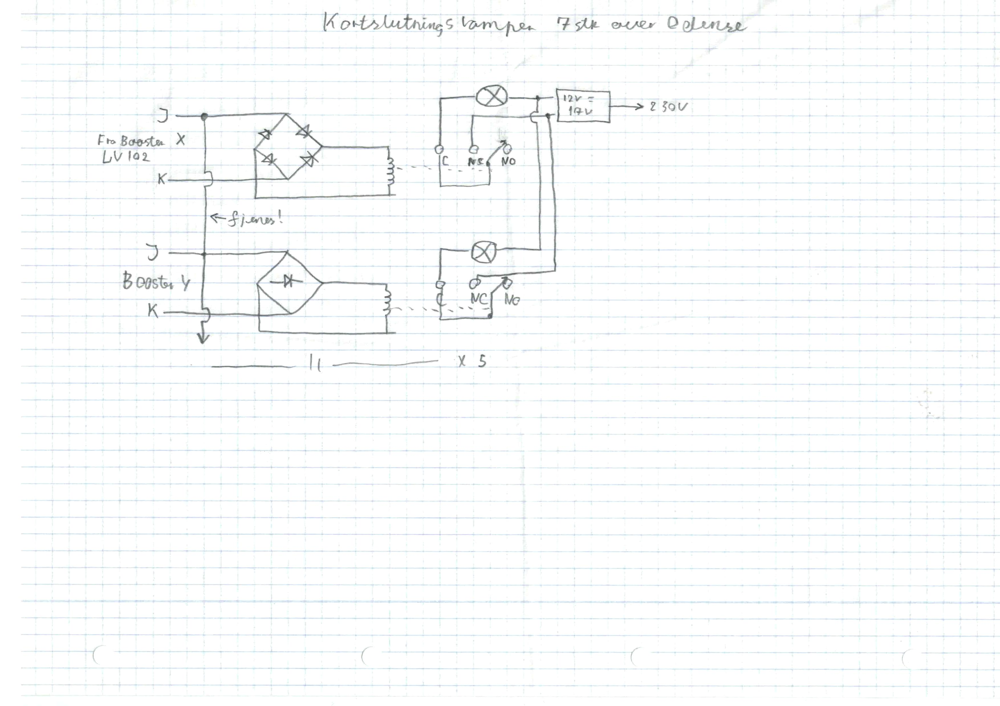

# Lenz

## Kilder

* Lenz
  * [LV102 DCC Power Station Manual](https://as.rumia.edu.pl/tt/dcc/Lenz/LV102.pdf)
  
## Ændringer til VORES LENZ installation

* Ændringer til LENZ installation:
  * Se velledning i [LV102 DCC Power Station Manual](https://as.rumia.edu.pl/tt/dcc/Lenz/LV102.pdf) afsnit 5.2, 5.3 & 5.4.
    * 
    * **5.2 Track connection:**  
    terminals J,K Connect the J and K wires to the track. The K wire represents the positive DCC polarity. Only use wires with sufficiently large cross-sections to connect the tracks and then twist this cable (we recommend 14-16 gauge wire). For best operation the J/K wires should be connected to your tracks at regular intervals.  
    **Note:** No radio interference suppression capacitor may be installed in the track system. This capacitor, if used with the Digital plus by Lenz ® system, will distort the data format and interfere with the fault-free transmission of data.  
    **Important:**  
    A mixed digital operation using overhead and track lines is not permitted. In this type of operational mode, the installed locomotive decoder can be destroyed by overvoltage if the locomotive is sitting on the track in the wrong direction (which might be the case e.g. after having driven through a terminal-loop)! We recommend operation using track pick-up, because the reliability of contact (and therefore the transmission of digital signals to the locomotive decoder) is substantially greater than it is when operating with overhead lines.  
    It is absolutely necessary that the electric circuits of all LV102 DCC Power Stations are of the same polarity. Thus, terminal J of one and terminal J of the next LV102 DCC Power Station must be connected to the same side of the track in question. Otherwise short-circuits will occur when driving over sectioning points. If you have several supply areas on your model railway layout, you will have to set the track voltage (output voltage) for the LV102 DCC Power Stations in use to the same value (see Section 6). 
    * **5.3 Connection to the command station:**  
    terminals C,D,E The LV102 DCC Power Station LV102 receives the data format from the command station via the terminals C and D (LZ100, LV102, compact). The terminals are connected to the terminals of the other LV102 DCC Power Stations, which have the same name. We recommend the use of a twisted cable. If terminal E of the LV102 DCC Power Station is connected to terminal E of the command station, the LV102 DCC Power Station will communicate an overload or a short-circuit to the command station. The command station then switches off all other LV102 DCC Power Stations and communicates this to all connected input devices via the XpressNet.
    * **5.4 Power Station Common ⊥ Connection**  
    The connection labeled ‘⊥‘ on the power plug is the power station common. This connection can be used in 2 rail wiring schemes to form a common between power stations.   
  * Elmer's tegningner
    * 
    * 

