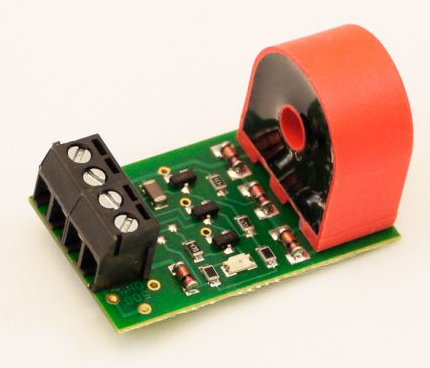
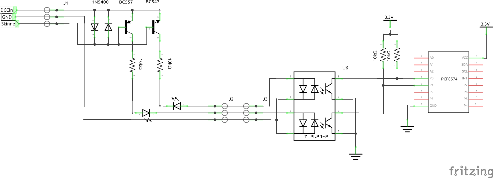

# OMJK

## [Home Assistant](./HomeAssistant/)

### Configurations

* [CONFIG](./HomeAssistant/CONFIG/)
  * [configuration.yaml](./HomeAssistant/CONFIG/configuration.yaml)
* [Blueprints](./HomeAssistant/CONFIG/Blueprints/)
  * [track_section_occupied.yaml](./HomeAssistant/CONFIG/Blueprints/train_occupied_sensor.yaml)
* [Automations](./HomeAssistant/CONFIG/Automations/)
  * [track section occupied 00_00](./HomeAssistant/CONFIG/Automations/Train%20occupied%20sensor%2000_00)

### [Lovelace](./HomeAssistant/Lovelace/lovelace.md)

* [Home](./HomeAssistant/Lovelace/lovelace.md#home)
  * 
* [pwm-with-pca9685](./HomeAssistant/Lovelace/lovelace.md#pwm-with-pca9685)
  * 
* [LedDriver](./HomeAssistant/Lovelace/lovelace.md#leddriver)
  * 
* [Occupied](./HomeAssistant/Lovelace/lovelace.md#occupied)
  * 
* [Track Reserved](./HomeAssistant/Lovelace/lovelace.md#track-reserved)
  * 

### [ESPHome](./HomeAssistant/ESPHome/esphome.md)

* [ESPHome files:](./HomeAssistant/ESPHome/esphome.md)
  * ESPHome's Secrets Files:
    * [secrets.yaml](./HomeAssistant/ESPHome/esphome.md#secretsyaml)
  * Leddriver Files:
    * ESPHome files:
      * [leddriver-xx.yaml](./leddriver-xx.yaml)
    * Fritzing Files;
      * [PCB-LedDriver-V6.1.fzz](https://github.com/sekt1953/Fritzing/blob/main/My_PCB/LedDriver/v6.1/PCB-LedDriver-V6.1.fzz)
    * FreeCAD Files:
      * [LedDriverv6.1a.FCStd](https://github.com/sekt1953/FreeCAD/blob/main/LeadDriverv6.1/LedDriverv6.1a.FCStd)
  * OccupiedSensor Files:
    * ESPHome Files:
      * [occupied-xx.yaml](./HomeAssistant/ESPHome/occupied-xx.yaml)
      * [Occupied-Hp.yaml "Holmstrup"](./HomeAssistant/ESPHome/Occupied-Hp.yaml)
    * Fritzing Files:
      * [occupied_sensor](https://github.com/sekt1953/Fritzing/blob/main/My_PCB/README.md#occupied_sensor-work-in-progress)
  * PWM with pca9685
    * 
    * ESPHome Files:
      * [/pca9685-xx.yaml](./HomeAssistant/ESPHome/pca9685-00.yaml)

## Sporbesat ideer

### Block Detector med BD20

|Block Detector med BD20|
|:---|
||

### Block Detector med Dioder &  BC557/BC547 & Optocoupler

Inspiration hentet hos [moppe.dk](https://www.moppe.dk/besat.html)

|Block Detector med Dioder &  BC557/BC547 & Optocoupler|
|:---|
||

## Stationsforkortelser

* john nissen
  * [Banesiden -> Forkortelser](https://www.john-nissen.dk/banesiden/Forkortelser/station.php)
* DSB
  * [Stationsforkortelser](https://www.dsb.dk/dsb-labs/liste-over-forkortelser/stationsforkortelser/)

## Signaler

* Kilde
  * Blokposten
    * [Elektriske sikringsanlæg](https://www.blokposten.dk/sikr/elek/elek-index.htm)

* Daglyssignaler
  * Dværgsignal
    * Dværgsignalet tilhøre den ældste type af daglyssignaler. Typen har været anvendt siden 1929 som rangersignal. Ved indførslen af relægruppeanlæggene blev typen meget anvendt som dækningssignal.
  * [PU-Signaler](./signaler/PU-Signaler.md)
    * Perronudkørselssignaler er en sammensmeltning af et togvejssignal og et dværgsignal. Perronudkørselsignal finder anvendelse på stort se samtlige stationer og er dermed den mest anvendte signaltypen.
  * Hovedsignal
    * Hovedsignaler er, hvis vi ser bort fra PU-signalet, alle opbygge af et antal løse lanternehuse der monteres på en sort bagplade.

## Togvej

* Kilde:
  * Blokposten
    * [Indkørselstogvej - type DSB 1953](https://www.blokposten.dk/sikr/elek/elek-dsb53-indk-betj.htm)

