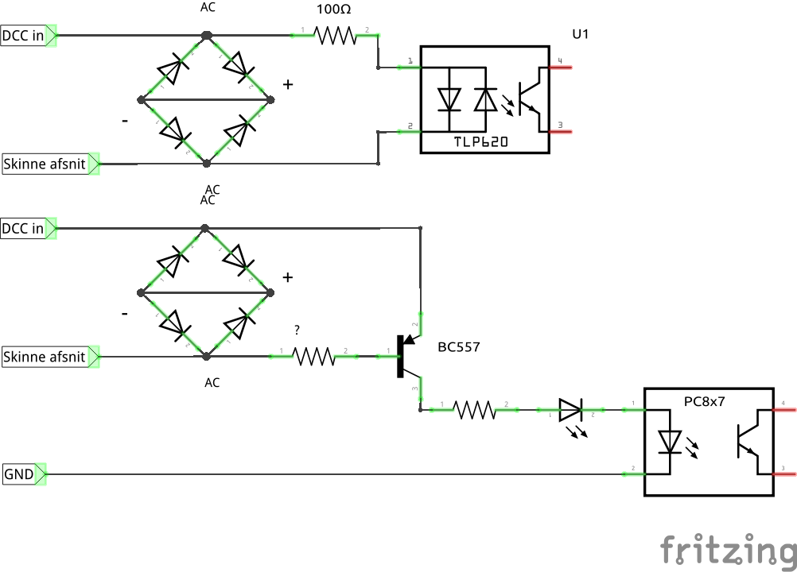
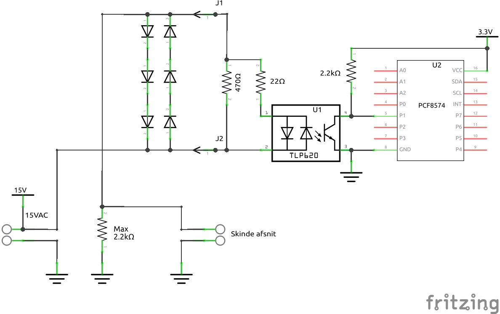
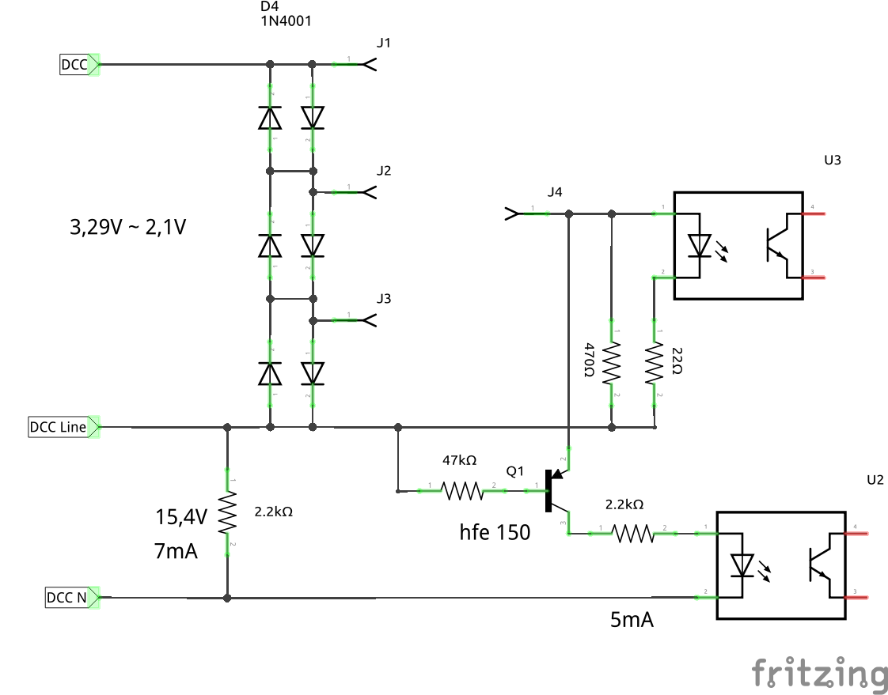

# Home Assistant as Railway Controler

## Why

* [Home Assistant](https://www.home-assistant.io/) can control many parts of my house, it can make sure the lights turn on when needed, it can control my lawnmower, it can check if someone is in the house, send an alarm if there is an unwanted visitor, so why don't use it to control our model railway, it's just some lights and some switches and a bit of logic.
* And not least, it is easy to program for non-programmers, and there is plenty of good documentation.
* To interface our model railway, [Home Assistant](https://www.home-assistant.io/) has built in [ESPHome](https://esphome.io/) which is an Arduino-like platform that allows us to use [ESP](https://esphome.io/components/esp32) & [Raspberry](https://esphome.io/components/rp2040) Microcontroller to interface with the model railway

### Step to get there

* to get a stable block detection to work, we must use block detection to feed our logic system.
* will be to be able to control our signals, since they will be our output from our logic system.
* will be to control our switches, as their position must be included in our logic system.
* other not know for now.

### Electronics building blocks

* I have spent half a year developing a set of building blocks like Lego bricks so we can use some standard components for the installation, all based on the [ESP](https://esphome.io/components/esp32) MCU and [ESPHome](https://esphome.io/).
* The first module is a Binary Input/Output with [PCF8574](https://www.nxp.com/docs/en/data-sheet/PCF8574_PCF8574A.pdf), connected to ESP32 via I2C interface, with it we will connect Block Detection modules to Home Assistant.
* To control our LEDs in signals and desks, I have been a long way around control via optocouplers, in order to be able to connect to already set up equipment, but found a small smart print with a [PCA9685](https://www.nxp.com/products/power-management/lighting-driver-and-controller-ics/led-controllers/16-channel-12-bit-pwm-fm-plus-ic-bus-led-controller:PCA9685) chip which has [PWM](https://da.wikipedia.org/wiki/Pulsbreddemodulation) output and [I2C](https://www.ti.com/lit/an/sbaa565/sbaa565.pdf?ts=1708812930096&ref_url=https%253A%252F%252Fwww.google.com.ar%252F) interface for [ESP](https://esphome.io/components/esp32) MCU.
* Driver for [LED Strip RGBWW V-TAC VT-505-60](https://www.ledproff.dk/12v-rgb-ledstrips/250-v-tac-108w-m-rgb-staenktaet-led-strip-5m-60-led-pr-meter-3800157676281.html), a desire has arisen to be able to control the lighting in the room when we drive according to the timetable, a strip of LED Strip has been purchased for this, so the next m´building block for our electronics is a drive that can interface with our Binary Input/Output module.

### Test and show progress

* I find the best way to see if something works is to show it in Home Assistant Views.
* it gives a quick overview of whether Block Detection works as desired, we can with the Home Assistant Companion App on our phone, follow our model train around the facility and get a visual information.
* In the same way, we can use another view to find and switch off Led in desks and signals, and thus get confirmation that the installation is in order.

### Network with OPNsense

* OPNsense is an open source, easy-to-use and easy-to-build FreeBSD based firewall and routing platform. OPNsense includes most of the features available in expensive commercial firewalls, and more in many cases. It brings the rich feature set of commercial offerings with the benefits of open and verifiable sources.
* By using OPNsense, we can separate our network, so that the model railway network is not accessible to everyone, but only to those who have to maintain it.  
We can have a public network where all members can use their laptop or phones to access the internet, use our printers  
and we can have a network where everyone has access to Internettet.

## Home Assistant

* [Setup](./HomeAssistant/README.md#setup)
  * [Hardware](./HomeAssistant/README.md#hardware)
  * [Software](./HomeAssistant/README.md#software)
  * [Configuration](./HomeAssistant/README.md#configuration)
    * [File structure](./HomeAssistant/README.md#file-structure)
    * [Basic Configuration](./HomeAssistant/README.md#basic-configuration)
  * [Helpers](./HomeAssistant/README.md#helpers)
  * [Blueprint](./HomeAssistant/README.md#blueprint)
  * [Automations](./HomeAssistant/README.md#automations)
  * [Dashboards](./HomeAssistant/README.md#dashboards)

## ESPHome

* [Setup](./ESPHome/README.md)
  * Configuration
    * File structure
    * Basic Configuration
* Software
  * ESP32 MCU
    * I2C_IO_Interface with 4xPCF8574
      * Block Detecsion with 8xBD20 interface
      * Block Detecsion with 12xDiode Interface
    * Led Driver with PCA9685
      * Led Strip Driver with 2xULN2803A & 16xIRLZ44
    * Led Driver with optocupler

## Network

* Network with OPNsense
  * DHCP Server
  * Net seperation
    * Train Network
    * Private Network
    * Public Network
  * Network switch

## DataBase Project

* [DataBase Project](./Database/README.md)
  * [Database server installation](./Database/README.md#database-server-installation)
  * [Creating Database in LibreOffice](./Database/README.md#creating-database-tables-in-libreoffice-mariadb)

### [Lovelace](./HomeAssistant/Lovelace/lovelace.md)

* [Home](./HomeAssistant/Lovelace/lovelace.md#home)
  * 
* [pwm-with-pca9685](./HomeAssistant/Lovelace/lovelace.md#pwm-with-pca9685)
  * 
* [LedDriver](./HomeAssistant/Lovelace/lovelace.md#leddriver)
  * 
* [Occupied](./HomeAssistant/Lovelace/lovelace.md#occupied)
  * 
* [Track Reserved](./HomeAssistant/Lovelace/lovelace.md#track-reserved)
  * 

### [ESPHome](./HomeAssistant/ESPHome/esphome.md)

* [ESPHome files:](./HomeAssistant/ESPHome/esphome.md)
  * ESPHome's Secrets Files:
    * [secrets.yaml](./HomeAssistant/ESPHome/esphome.md#secretsyaml)
  * Leddriver Files:
    * ESPHome files:
      * [leddriver-xx.yaml](./leddriver-xx.yaml)
    * Fritzing Files;
      * [PCB-LedDriver-V6.1.fzz](https://github.com/sekt1953/Fritzing/blob/main/My_PCB/LedDriver/v6.1/PCB-LedDriver-V6.1.fzz)
    * FreeCAD Files:
      * [LedDriverv6.1a.FCStd](https://github.com/sekt1953/FreeCAD/blob/main/LeadDriverv6.1/LedDriverv6.1a.FCStd)
  * OccupiedSensor Files:
    * ESPHome Files:
      * [occupied-xx.yaml](./HomeAssistant/ESPHome/occupied-xx.yaml)
      * [Occupied-Hp.yaml "Holmstrup"](./HomeAssistant/ESPHome/Occupied-Hp.yaml)
    * Fritzing Files:
      * [occupied_sensor](https://github.com/sekt1953/Fritzing/blob/main/My_PCB/README.md#occupied_sensor-work-in-progress)
  * PWM with pca9685
    * 
    * ESPHome Files:
      * [/pca9685-xx.yaml](./HomeAssistant/ESPHome/pca9685-00.yaml)
    * FreeCAD files:
      * [Mount for PCA9685 PCB](https://github.com/sekt1953/FreeCAD#mount-for-pca9685-pcb)

## Sporbesat ideer

### Block Detector med BD20

Vi bruger denne løsning på Holmstrup (Hp) Station.

|Block Detector med BD20|
|:---|
||

* [ESPHome files:](./README.md#esphome)
  * [Occupied-Hp.yaml](https://github.com/sekt1953/OMJK/blob/main/HomeAssistant/ESPHome/Occupied-Hp.yaml)
* Fritzing files:
  * [README.md#occupied-hp-proto](https://github.com/sekt1953/Fritzing/blob/main/My_PCB/README.md#occupied-hp-proto)

### Block Detector med Dioder &  BC557/BC547 & Optocoupler

Inspiration hentet hos [moppe.dk](https://www.moppe.dk/besat.html)

|Block Detector med Dioder &  BC557/BC547 & Optocoupler|
|:---|
||

### Block Detector med Brokobling & Optocoupler

Inspiration hentet hos [moppe.dk](https://www.moppe.dk/besat.html),  
  vi skal nok bruge Dioder af typen 1N5400 grundet vores strømforbrug.

|Block Detector med Brokobling & Optocoupler|
|:---|
||

### Block Detector med 6 Dioder & Optokobler

Denne opstilling anvender vi i Frederica (Fa) station

|Block Detector med Brokobling & Optokobler|
|:---|
||

### Block Detector test

|Block Detector test|
|:---|
||

## Stationsforkortelser

* john nissen
  * [Banesiden -> Forkortelser](https://www.john-nissen.dk/banesiden/Forkortelser/station.php)
* DSB
  * [Stationsforkortelser](https://www.dsb.dk/dsb-labs/liste-over-forkortelser/stationsforkortelser/)

## Signaler

* Kilde
  * Blokposten
    * [Elektriske sikringsanlæg](https://www.blokposten.dk/sikr/elek/elek-index.htm)

* Daglyssignaler
  * Dværgsignal
    * Dværgsignalet tilhøre den ældste type af daglyssignaler. Typen har været anvendt siden 1929 som rangersignal. Ved indførslen af relægruppeanlæggene blev typen meget anvendt som dækningssignal.
  * [PU-Signaler](./signaler/PU-Signaler.md)
    * Perronudkørselssignaler er en sammensmeltning af et togvejssignal og et dværgsignal. Perronudkørselsignal finder anvendelse på stort se samtlige stationer og er dermed den mest anvendte signaltypen.
  * Hovedsignal
    * Hovedsignaler er, hvis vi ser bort fra PU-signalet, alle opbygge af et antal løse lanternehuse der monteres på en sort bagplade.

## Togvej

* Kilde:
  * Blokposten
    * [Indkørselstogvej - type DSB 1953](https://www.blokposten.dk/sikr/elek/elek-dsb53-indk-betj.htm)

