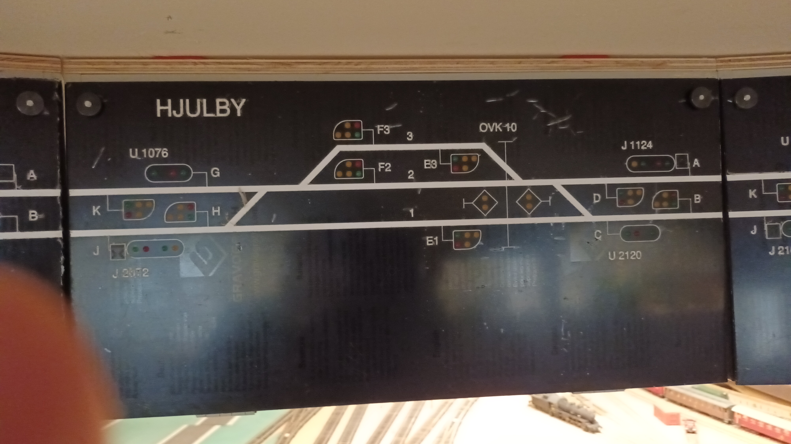

# [Hjulby Station (Ju) ](https://danskejernbaner.dk/vis.station.php?FORLOEB_ID=260&content=Hjulby-Station-(Ju))

|Grafic|Cap|
|:---:|:---:|
|||

* Hjulby
  * [Kilde:](./Kilde/)
    * [danskejernbaner.dk](https://danskejernbaner.dk/vis.station.php?FORLOEB_ID=260&content=Hjulby-Station-(Ju))
    * Pult
      * [Hjulby_Pult_Klemrække_A.pdf](./Kilde/Hjulby_Pult_Klemrække_A.pdf)
      * [Hjulby_Pult_Klemrække_B.pdf](./Kilde/Hjulby_Pult_Klemrække_B.pdf)
      * [Hjulby_Pult_Klemrække_C.pdf](./Kilde/Hjulby_Pult_Klemrække_C.pdf)
      * [Hjulby_Pult_Klemrække_D.pdf](./Kilde/Hjulby_Pult_Klemrække_D.pdf)
      * [Hjulby_Pult_Klemrække_E.pdf](./Kilde/Hjulby_Pult_Klemrække_E.pdf)
    * [Signaler](./Kilde/Signal/)
      * Hjulby Signal Klemrække
        * [Hjulby_Signal_Klemrække_AB.pdf](./Kilde/Signal/Hjulby_Signal_Klemrække_AB.pdf)
        * [Hjulby_Signal_Klemrække_C.pdf](./Kilde/Signal/Hjulby_Signal_Klemrække_C.pdf)
      * Hjulby Signaler
        * [Hjulby_Signal_Typer.pdf](./Kilde/Signal/Hjulby_Signal_Typer.pdf)
        * [Hjulby_Signal_A.pdf](./Kilde/Signal/Hjulby_Signal_A.pdf)
        * [Hjulby_Signal_B.pdf](./Kilde/Signal/Hjulby_Signal_B.pdf)
        * [Hjulby_Signal_C.pdf](./Kilde/Signal/Hjulby_Signal_C.pdf)
        * [Hjulby_Signal_D.pdf](./Kilde/Signal/Hjulby_Signal_D.pdf)
        * [Hjulby_Signal_E1.pdf](./Kilde/Signal/Hjulby_Signal_E1.pdf)
        * [Hjulby_Signal_E3.pdf](./Kilde/Signal/Hjulby_Signal_E3.pdf)
        * [Hjulby_Signal_F2.pdf](./Kilde/Signal/Hjulby_Signal_F2.pdf)
        * [Hjulby_Signal_F3.pdf](./Kilde/Signal/Hjulby_Signal_F3.pdf)
        * [Hjulby_Signal_G.pdf](./Kilde/Signal/Hjulby_Signal_G.pdf)
        * [Hjulby_Signal_H.pdf](./Kilde/Signal/Hjulby_Signal_H.pdf)
        * [Hjulby_Signal_J.pdf](./Kilde/Signal/Hjulby_Signal_J.pdf)
        * [Hjulby_Signal_K.pdf](./Kilde/Signal/Hjulby_Signal_K.pdf)
    * Sporskifter
      * [Hjulby Sporskifter Klemrække](./Kilde/Hjulby_Sporskifte_Klemrække.pdf)
    * [Images](./Images/)
      * [Sporplan](./Images/Hjulby-Sporplan.png)
      * [Sporplan_01](./Kilde/Skærmbillede%20fra%202024-03-03%2012-00-01.png)
      * [Sporplan_02](./Kilde/Skærmbillede%20fra%202024-03-03%2012-01-28.png)
      * [Sporplan_03](./Kilde/Skærmbillede%20fra%202024-03-03%2012-02-16.png)
  * Anlæg
    * Block Detection
      * [Hjulby Block Detection](./Hjulby_Block_Detection.md)
    * Signaler
      * [Hjulby Signaler](./Hjulby_Signal_led.md)
    * Sporskifter
  * Pult
    * [Hjulby Pult Tryk Sporskifter](Hjulby_Tryk_Sporskifter.md)
    * [Hjulby Pult Led](./Hjulby_Pult_Led.md)
  * ESPHome
    * I2C_IO_PCF8574
      * .pcf8574_ids_ju_pult.yaml
      * .pcf8574_input_ju_pult.yaml
      * .pcf8574_ids_ju_bd.yaml
      * .pcf8574_input_ju_bd.yaml
    * I2C_O_PCA9685
