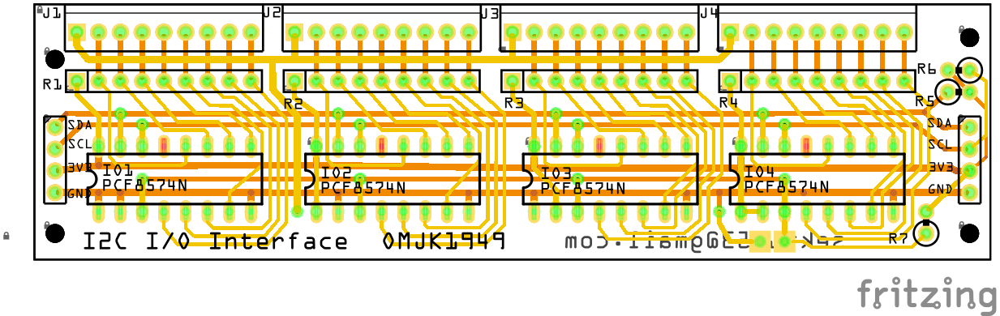
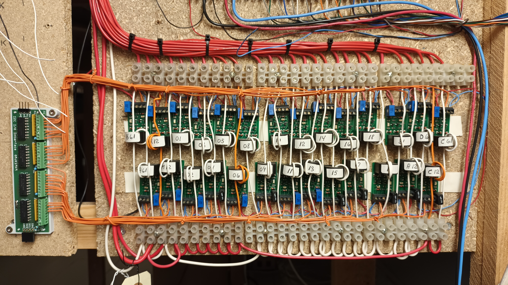

# Hjulby (Ju) Block Detection

## Connections

* BD20
  * [BD20 manual](./)
* I2C_IO_Interface_pcb
  * 
  * [Fritzing I2C_IO_Interface_pcb](https://github.com/sekt1953/Fritzing/blob/main/My_PCB/Modeltog/I2C_%20IO_Interface/I2C_IO-Interface.md#i2c-io_interface)
* ESPHome yaml:
  * ju-bd-00.yaml
    * esphome_name: "ju-bd-00"
    * esphome_friendly_name: "Hjulby-Block-Detection-00"
  * include files:
    * ./I2C_IO_PCF8574/.pcf8574_ids.yaml
    * ./I2C_IO_PCF8574/.pcf8574_input.yaml
* Images
  * 

### BD20 -> I2C IO_Interface PCB

|Block|/|MCU Addr.|MCU Terminal Addr.|Entites Name|
|:---:|:---:|:---:|:---:|:---:|
|GND|/||GND||
|B61|/|0x20|_07|ju-bd-a61|
|K12|/|0x20|_06|ju-bd-k12|
|01|/|0x20|_05|ju-bd-01|
|03|/|0x20|_04|ju-bd-03|
|05|/|0x20|_03|ju-bd-05|
|08|/|0x20|_02|ju-bd-08|
|10|/|0x20|_01|ju-bd-11|
|12|/|0x20|_00|ju-bd-12|
||/||GND||
|14|/|0x21|_07|ju-bd-14|
|16|/|0x21|_06|ju-bd-16|
|18|/|0x21|_05|ju-bd-18|
|21|/|0x21|_04|ju-bd-21|
|D61|/|0x21|_03|ju-bd-d61|
|C61|/|0x21|_02|ju-bd-c61|
|A61|/|0x21|_01|ju-bd-a61|
|M12|/|0x21|_00|ju-bd-m12|
||/||GND||
|02|/|0x22|_07|ju-bd-02|
|04|/|0x22|_06|ju-bd-04|
|06|/|0x22|_05|ju-bd-06|
|09|/|0x22|_04|ju-bd-09|
|11|/|0x22|_03|ju-bd-11|
|13|/|0x22|_02|ju-bd-13|
|15|/|0x22|_01|ju-bd-15|
|17|/|0x22|_00|ju-bd-17|
||/||GND||
|19|/|0x23|_07|ju-bd-19|
|A12|/|0x23|_06|ju-bd-a12|
|C12|/|0x23|_05|ju-bd-c12|
||/|0x23|_04||
||/|0x23|_03||
||/|0x23|_02||
||/|0x23|_01||
||/|0x23|_00||