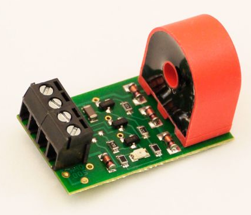

# Udstyr

## Occupied sensor to bee used with NCE 5240205 Block Detector BD20

Denne enhed bruges på Holmstrup Station (Hp) for detering af sporbesat. Vi tilslutter den til vores [Occupied Hp Proto](https://github.com/sekt1953/Fritzing/blob/main/My_PCB/README.md#occupied-hp-proto) for at få informationen ind i Home Assistant for automatisering.

|Block Detector BD20|
|:---|
||

* NCE 5240205 Block Detector BD20:
  * [Tony's Train Change](https://tonystrains.com/product/nce-5240205-block-detector-bd20)
  * [NCE-BD20-Manual](https://www.dccconcepts.com/manual/nce-owners-manual-bd20-block-detector/nce-bd20-manual-2/)
* [Fritzing files:](https://github.com/sekt1953/Fritzing)
  * [Occupied Hp Prototype](https://github.com/sekt1953/Fritzing/blob/main/My_PCB/README.md#occupied-hp-proto)
* [ESPHome files:](https://github.com/sekt1953/OMJK#esphome)
  * [Occupied-Hp.yaml "Holmstrup"](https://github.com/sekt1953/OMJK/blob/main/HomeAssistant/ESPHome/Occupied-Hp.yaml)
* [Home Assistant files:](https://github.com/sekt1953/OMJK/tree/main#home-assistant)
  * Blueprints:
    * [train_occupied_sensor.yaml](https://github.com/sekt1953/OMJK/blob/main/HomeAssistant/CONFIG/Blueprints/train_occupied_sensor.yaml)